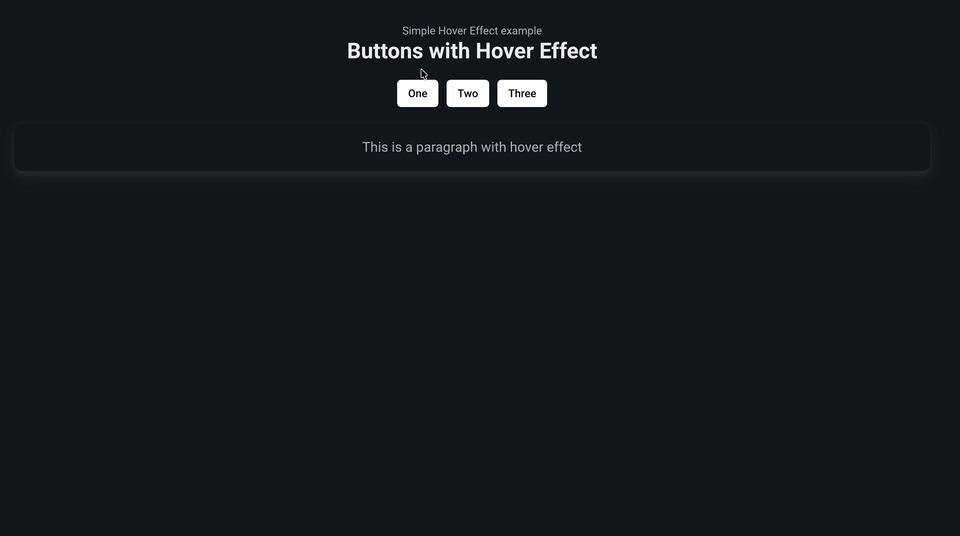

For the last few days, I've been experimentating and doing some more work with CSS, specifically with the idea having nice hover animations for the blog. What lead me down this route was swapping from Tailwind to Bulma for my blog which lead me to having to do a bit more work to get certain things to work nicely.

And I managed to find a neat little trick with the fairly simple transformX and transformY methods in css.


_A gif of the hover effect in action_

# How does it work?

It's dead simple to use, to quote the readme I wrote up.
The trick is to simple create a wrapper component like so :

```jsx
import React from "react";
import styles from "./HoverEffect.module.css";

const HoverEffect = ({ children }) => {
  return <div className={styles.hoverEffect}>{children}</div>;
};

export default HoverEffect;
```

And make the CSS do the following :

```css
/* Simple CSS trick to make it look like the button is moving up when hovered */
.hoverEffect {
  transition: transform 0.3s ease;
}

.hoverEffect:hover {
  transform: translateY(-10px);
  /* Uncomment below to have it go sideways instead of up and down*/
  /* transform: translateX(-10px); */
}
```

If you navigate to the example component, you can see how this works :

```jsx
// Example component that uses the HoverEffect
const ExampleComponent = () => {
  return (
    <>
      <div className="title">Buttons with Hover Effect</div>
      <div className="mb-4"></div>
      <div className="buttons is-centered">
        {/* Wrap the component you want to have this effect by simply wrapping it
            - Note that you can achieve the same effect by using the individual CSS
        */}
        <HoverEffect>
          <button class="button is-white">One</button>
        </HoverEffect>
        <HoverEffect>
          <button class="button is-white">Two</button>
        </HoverEffect>
        <HoverEffect>
          <button class="button is-white">Three</button>
        </HoverEffect>
      </div>
      <div className="mb-4"></div>
      <HoverEffect>
        <div className="box is-light">
          <div className="content is-medium">
            <p>This is a paragraph with hover effect</p>
          </div>
        </div>
      </HoverEffect>
    </>
  );
};

export default ExampleComponent;
```

Note that for this site/demo, we did use React/Bulma to showcase how it is used however there is no reason why you could use a different css library or js framework entirely. It's quite easy to implement a transform and the overall result is quite nice in my opinion, considering the amount of time it takes to do something like this.

# How to use it?

You can check it out on the demo site or look at the hover effect example repo I spun up, it's being hosted on Vercel for the moment.

- [Hover Effect demo site](https://hover-effect-example.vercel.app/)
- [Hover Effect Github Repo](https://github.com/effeect/hover-effect-example)

Feel free to modify it and take it, it's so simple and quite effective. I wish I knew it sooner.

Thanks for reading,
Ollie
