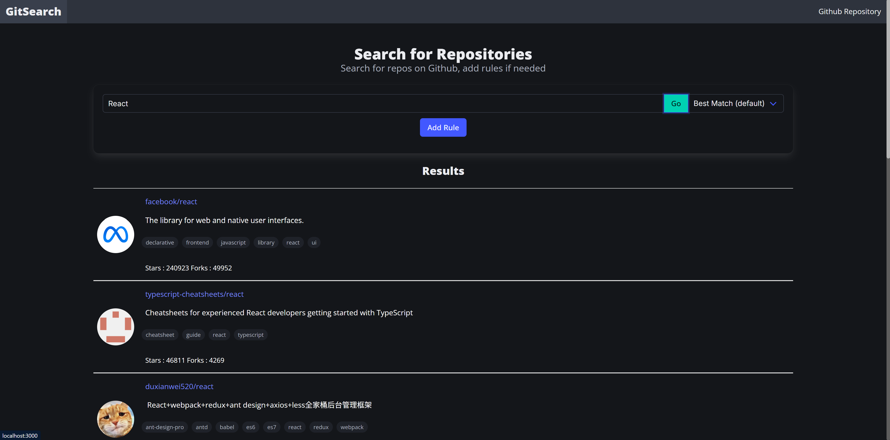
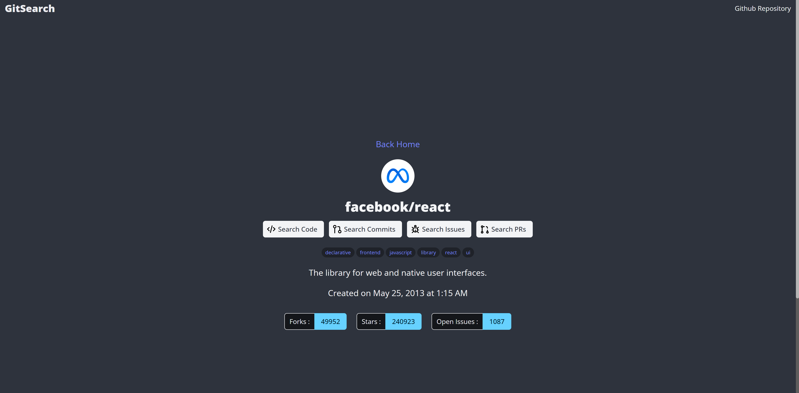

Apologies for the time between the last post and this one as I've been a little busy as of late with travelling and doing some language study on the side. Anyways.

For the last week or so, I've worked on a little project that allows for searching GitHub repos using the Github REST API, and this project is using React and some other cool stuff. Whilst there are things I would change upon reflection, I am pretty happy with the way it turned out.

You can find it on [here](https://gitsearch-liard.vercel.app/)

_The Main Search Page_

_The page you see when you click on a page_

This project does not use Next.js or anything and it's designed to be relatively small.

# What can this thing do?

GitSearch can do the following things :

- Search for repositories on **GitHub** using the GitHub REST API via Octokit, able to sort by Stars/Forks/Updated and also add qualifiers (known as rules in the UI)
- Search for **code** within a said repository
- Search for **issues** within a said repository
- Search for **PRs** within a said repository
- Search for **commits** within a said repository

There are fairly few NPM packages in play for this project, the main ones of note are React, React Router, Octokit and the Bulma CSS framework.

# What I would change/improve?

Whilst I'm happy with the result, there are some things I would like to change/improve in the future upon reflection :

- There is fairly basic error handling, and I'm not handling any API errors from GitHub in a nice way. I would like to spend some more time handling it so the UI can respond correctly.
- There is code for a SearchUser.ts file under /api/, however, I didn't feel like it fit the scope of this app. However, it can be quickly implemented if needed.
- There is a route for a "file viewer" which would allow you to click the code item and view it within the app without going to GitHub directly. However, it wasn't particularly great, and I decided to just redirect to the specific file on GitHub. This can be changed.
- Not all qualifiers are included in the search items as some of the qualifiers can get a bit complex. I decided to limit them; however, the type interfaces are defined so they can be added back in quickly.
- I wanted to implement view transitions for the router <Link>’s, but I didn't get time to look into it too much.
- The "label" qualifier has an issue where if you don't put "" around the label, it will not work.
- I would also like to implement a better way to show off metadata. I've had some good experiences with Next.js when it comes to handling it; however, I wasn't wanting to add more npm packages for something relatively small and minor.

I might have another crack at this and see if I can make it any better than it currently is, but I am happy with the result.

Many Thanks,
Ollie
