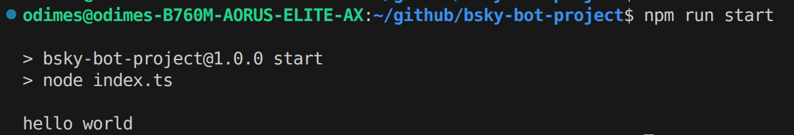
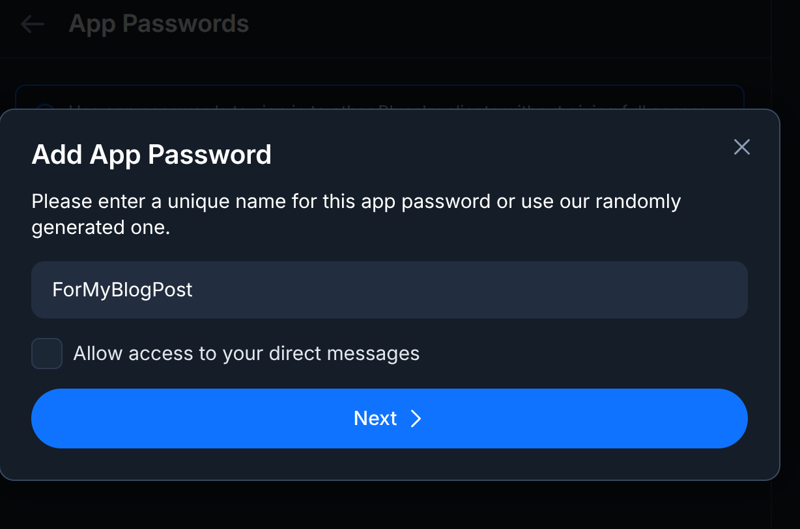
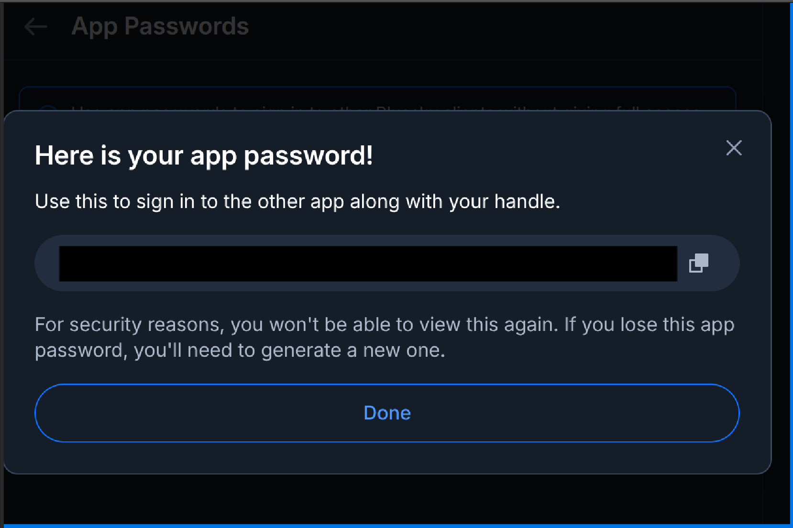
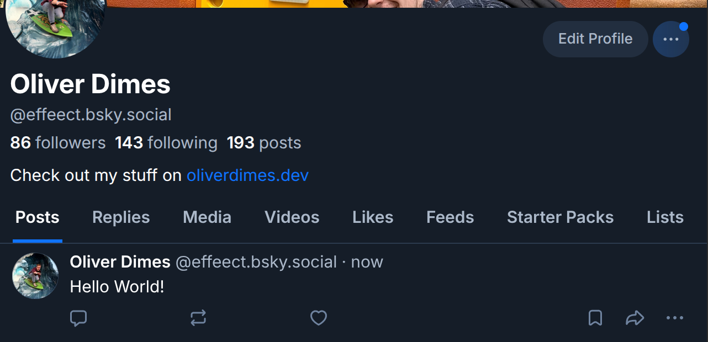

**Today**, I wanted to discuss the use case and the making of a simple social media posting bot on the social media platform BlueSky, which is kind of like Twitter.

Whilst this seems a bit simple on paper, there is quite a few things you can do with the [AT Protocol API](https://docs.bsky.app/) that Bluesky is built on, and I'm hoping to showcase some of that today in this post.

We will be building this example with Node.js using Typescript.

# Step 1 : Getting the environment setup

The first thing to do is to get the environment setup, before starting please make sure you have Node installed.

For now, we will just do a simple `npm init -y` and install the following packages :

```bash
npm install typescript
npm install ts-node
npm install tsx
npm install @types/node
# Not required but needed if we want to use environment variables
npm install dotenv
# Below is the package needed for Bsky stuff
npm install @atproto/api
```

After installing, add a start script with the command `tsx index.ts` and change the type of `module` to the `package.json`, it should look like so :

```json
{
  "name": "bsky-bot-project",
  "version": "1.0.0",
  "description": "A test project",
  "main": "index.ts",
  "scripts": {
    "test": "echo \"Error: no test specified\" && exit 1",
    "start": "tsx index.ts" // THIS NEEDS TO BE ADDED
  },
  "keywords": [],
  "author": "",
  "license": "ISC",
  "type": "module" // CHANGE THIS
}
```

Then, create a file called `index.ts` and this will be the main entry point of the app. If we run `npm run start` we should get the console.log working :


_Running the command to get a console.log back, super quick and easy_

# Step 2 : Setup Bluesky Account

If you haven't done already, the next step is sign up for an account which can be done at [bsky.app](https://bsky.app/). Once signed in, you will need to create an App Password which can be found under `settings`, `privacy and security` and `app passwords` (or click this [link](https://bsky.app/settings/app-passwords)).

You can easily create an "app password", I would recommend putting a name stating the project name. In this case mine is quite obvious.


_A simple but good name_

After submitting, you should get your app password. PLEASE, take care of this and treat this like any API key, so save it in a secure place and note that you will not be able to view it again and will have to create a new one if you lose the details.


_Censored but should look like this_

With that out of the way, we are going to get our credentials' setup, the best way to do this in our Node environment is use a `.env` file and the `dotenv` functionality we installed earlier. We will create a `.env` file which looks like this :

```bash
BLUESKY_USERNAME=*BLUESKY_USERNAME_HERE*
BLUESKY_PASSWORD=*APP_PASSWORD_NAME_HERE*
```

In order to test if the .env variables are being read, do the following

```ts
import dotenv from "dotenv";

dotenv.config();
// Please don't do this in prod, just for demonstration sakes
console.log(process.env.BLUESKY_USERNAME);
console.log(process.env.BLUESKY_PASSWORD);
```

# Step 3 : Write a small post

Now for the main magic event, we are going to post something to Bluesky. What I am aiming for is just a way to post something to the platform without too much hassle, so it's easy for you to replicate.

_Note that this method works as of writing of March 4th, the AtProto documentation changes constantly and things are getting changed up every few weeks. This method is the one that is recommended on their NPM README_

```ts
import { Agent, CredentialSession, type AtpAgentLoginOpts } from "@atproto/api";
import dotenv from "dotenv";

// Takes in the .env
dotenv.config();

// Putting the variables in a AtpAgentLogin object
const account: AtpAgentLoginOpts = {
  identifier: `${process.env.BLUESKY_USERNAME}`,
  password: `${process.env.BLUESKY_PASSWORD}`,
};

// Below can be wrapped into an async authenticate function but this should be fine for the moment
const session = new CredentialSession(new URL("https://bsky.social"));
await session.login(account);
const agent = new Agent(session);

// The important bit
async function main() {
  await agent.post({
    text: "Hello World!",
  });
  console.log("Just posted!");
}

// With this setup, it's quite trivial to wrap it in CI/CD and just run main
main();
```

If you run this file, you should get the `console.log` statement saying the post has been posted, and you should see a post on the Bluesky account you had just setup. Below is what it looked like on my account.


_My own personal account posting Hello World!_

So with that in mind, your mind is now probably racing about what kind of things you can do with this, for example you could :

- Post a weather report for a local area and issue warnings when needed
- Post a notification when an event goes live (Maybe a Youtube Livestream or something along those lines)
- Post a fun fact of the day

Note that this API does have a lot of depth, and I've done the bare minimum. I'm planning to write more about it soon. If you would like to see a bot that I have made in action.

There is a Random Games bot that is actively posting which can be found at : [igdbrandomgame.bsky.social](https://bsky.app/profile/igdbrandomgame.bsky.social). There is also a post explaining this bot which contains some of the same information found [here](https://oliverdimes.dev/posts/writing-a-bsky-post), but it's a bit more high level.
