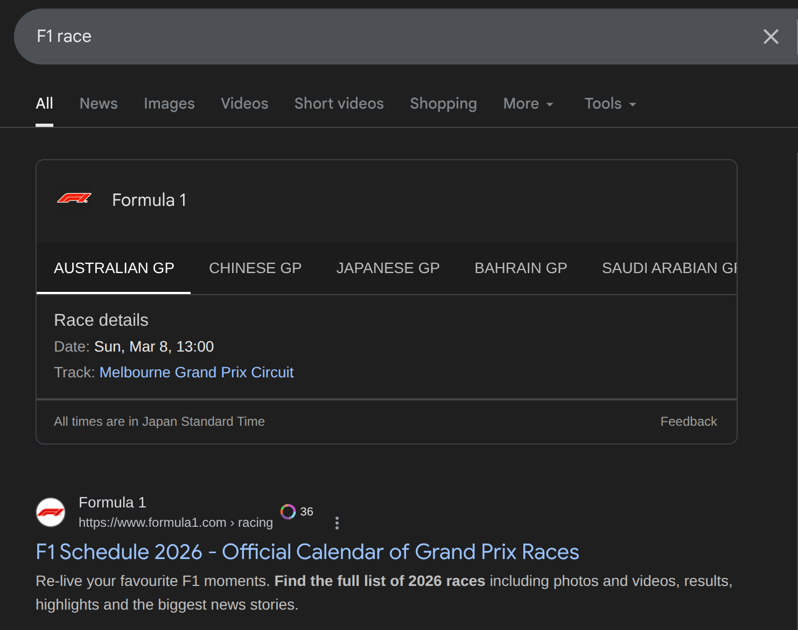
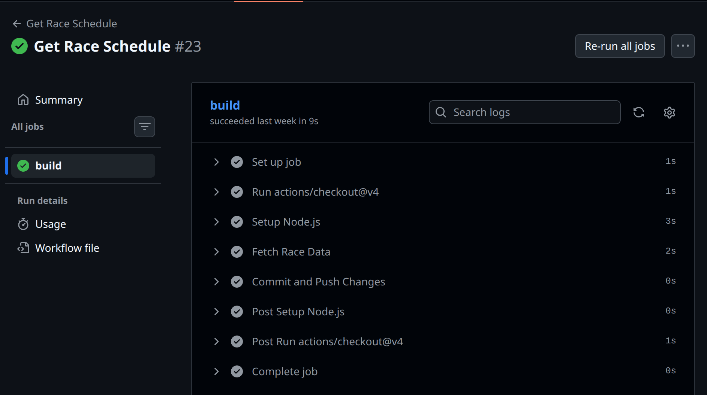
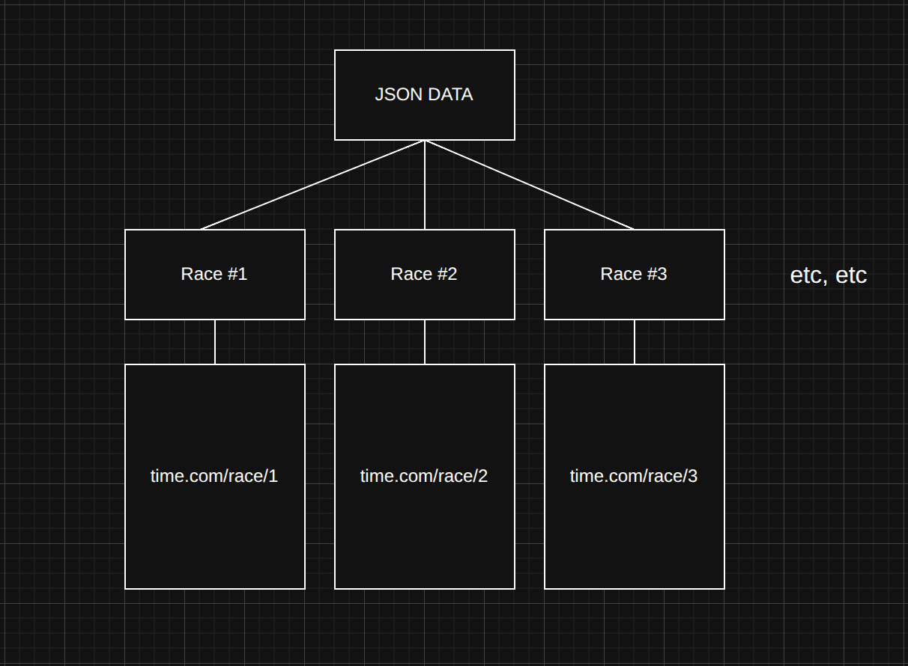
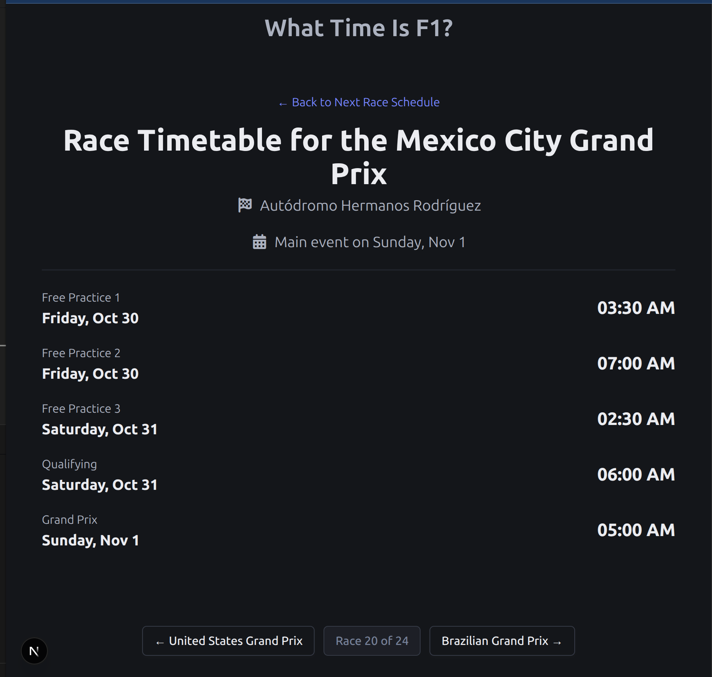

**With Formula One on the horizion**, one of the things I wanted to tackle was to find an easy way to get the timetable data for the next race.


_A google search for next f1 race_

Whilst this sounds like a simple objective – searching “what time is F1?” on Google/DuckDuckGo – these tools have always frustrated me. A lot of the time, they won’t give session times for each session and will often only return the main event, which isn't ideal if you are a fan of the sport.

And whilst the official F1 site is notably better, I felt like there was way too much information, and all I wanted was a simple and easy-to-read site. Ideally, this would automatically redirect the user to the next event and offer an option to browse the other races. Hence, me starting to see if I could solve this.

_Note, some of these points have already been touched upon in previous posts, this article however will be much more detailed and explain some of the design decisions and comprimises that I made for this site._

# Step 1 : Getting the Data

The first step of any statically generated site like this is to figure out a way to get the data and have it available for Next.js to statically generate it. I did ponder for a bit how to go about this sensibly and within the constraints.

What I didn’t want to do was constantly make API calls when the user navigates to the site. I wanted all of the HTML data to be effectively calculated beforehand and served to the user. Similar to how most blogging systems handle lots of posts, including this blog infact.

The idea that I sketched up in my head looks like this :

- Have a script that will fetch the data (can be in Node/Python or Go)
- This script will have to fetch the entire race schedule for the current year and save all that data to a .json file.
- This json file can then be read by Next.js using [generateStaticParams](https://nextjs.org/docs/app/api-reference/functions/generate-static-params) and we can then generate a page for each race in the calendar year
- This means when the user loads the page at whatever domain I end up using, the data will be stored on the website. So no need to do API calls or fetching for the race.
- We can trigger this script fetching with a Github Action and just print out the data.

This solution sounds promising on paper, however there are a few issues with doing this sort of method :

- Security wise, having the data stored like this effectively means its out in the open.
- If the API key is needed for the data, storing data like this could be problematic. It’s possible to store API keys in secrets in GitHub Actions, but having them stored like this can lead to issues.

With these compromises in my mind, I decided to go along with this method, mostly because the API that I found does not actually require an API key and can be called without one. You can use it too!

The API that I decided to take advantage of is [jolpica-f1](https://github.com/jolpica/jolpica-f1) which doesn't require any API key and can be easily called, it's relatively easy to get the current year by doing the following in node.js.

```js
let currentYear = new Date().getFullYear();
// First of all, need to fetch the count for the total number of files
const baseUrl = `http://api.jolpi.ca/ergast/f1/${currentYear}`;
```

I decided to design this data fetching script in Node.js, there is no particular advantage with using Node.js over any other language for this data fetching as it's fairly basic.

In order to fetch the data we call this :

```js
const Races = await fetch(baseUrl, { method: "GET" })
  .then((res) => res.json())
  .then((data) => data.MRData.RaceTable.Races);
```

This will return every detail about the calendar. Now we don’t need all of this info saved to a local file, and it's probably better to filter out some of this data.

What I decided was to take the track name and country location and map the session data to it:

```js
for (let i = 0; i < Races.length; i++) {
  let sessions = {};
  // Checking if this is a sprint weekend or not
  if (!Races[i].SecondPractice) {
    sessions = {
      fp1: Races[i].FirstPractice,
      sprintqualifying: Races[i].SprintQualifying,
      sprint: Races[i].Sprint,
      qualifying: Races[i].Qualifying,
      race: Races[i],
    };
  } else {
    sessions = {
      fp1: Races[i].FirstPractice,
      fp2: Races[i].SecondPractice,
      fp3: Races[i].ThirdPractice,
      qualifying: Races[i].Qualifying,
      race: Races[i],
    };
  }
}
```

The only thing I'm not happy about is with the sessions name, as they may not always be the same. Instead of each session being identified by an ID/number, they have a string ("Practise 1, Practise 2, Practise 3 etc etc). Whilst this would be fine a few years ago, some race events may have custom ones hence this awkward if/else statement. It's not the end of the world but it should be ok.

After doing this, we just simply write the data to a local file like so, this script is designed to be ran as a Github Action but it can be ran locally as well. This entire script uses standard library Node which means any recent version of Node should be able to run this without any additional config.

```js
// Saves the file to the output path
fs.writeFileSync(outputPath, JSON.stringify(processedData, null, 2));
```

You can view the complete file here on [Github](https://github.com/effeect/what-time-is-f1-next/blob/main/src/api/get-year-schedule.js)

# Step 2 : Sorting out a CI/CD workflow

The next step was to automate the generation of this output file when needed. My idea was to set up a GitHub Action that would run the Node script, generate the json file, and then commit the changes directly to the GitHub repository.


_A github action overview page_

So in this [workflow](https://github.com/effeect/what-time-is-f1-next/blob/ad08287b9f32ccf82615877a1fceae60f91445fa/.github/workflows/node.js.yml), the first thing we do is spin up Ubuntu and setup-node action.

```yaml
runs-on: ubuntu-latest
steps:
  - uses: actions/checkout@v4

  - name: Setup Node.js
    uses: actions/setup-node@v4
    with:
      node-version: 22
      cache: "npm"
```

With this environment setup and ready to go, we just run the scripts and do a `git add` / `git commit`/ `git push` to the files we generated :

```yaml
# Below is what will fetch the data, note that we don't use any node packages to so no npm install needed
- name: Fetch Race Data
  run: |
    node src/api/get-schedule.js 
    node src/api/get-year-schedule.js
- name: Commit and Push Changes
  run: |
    git config --global user.name "github-actions[bot]"
    git config --global user.email "github-actions[bot]@users.noreply.github.com"
    git add ./public/data/schedule.json
    git add ./public/data/year_schedule.json
    git commit -m "chore: update generated files" || echo "No changes to commit"
    git push
```

While there are more ways to handle this, saving the data within the GitHub repository and committing it isn’t ideal. The end result client wise should be the same because the data has already been generated.

# Step 3 : Building the front end with Next.js

**Now the fun (or unfun part to some)**, it's time to build the frontend of this project, leveraging Next.js with Bulma.css.

My idea of how to handle the data and static data is quite simple.


_Flowchart showcasing the data flow that I'm intending, so each race event would get their own specific web page generated and we can navigate to it. Kind of like an overkill blog._

So in this case, we will generate a seperate page for each race event. In order to do this in Next.js, we need to first of all read the local.json file that we made earlier (note that this can modified to be an actual API endpoint in future).

```ts
export function getRaceData() {
  try {
    if (typeof window === "undefined") {
      const filePath = path.join(
        process.cwd(),
        "public",
        "data",
        "schedule.json",
      );
      const jsonData = fs.readFileSync(filePath, "utf-8");
      return JSON.parse(jsonData);
    }
    catch(error){
        /* ... */
    }
  }
  }
```

After doing that, we need to create a folder in the structure of `/app/race/[round]`, note the `[round]` bit as that will be the parameter, so if we were to navigate to `https://site.com/race/1`, we will be navigated to the first race of the year.

```tsx
// Grab the static params for each round from the year schedule data
export async function generateStaticParams() {
  const yearRaceData = await getYearRaceData();
  // We will go through the data, map the round number so we should have 24 pages available to us (as the round numbers are listed as Round 1,2,3 etc etc)
  return yearRaceData.customRaceData.map((item: any) => ({
    round: item.race.sessions.race.round,
  }));
}
```

The benefit of this approach is that we only generate the 24 pages needed, as the `.map()` function creates a page for each round number. So if I were to try navigating to `https://site.com/race/jellybeans`, it would return a 404 error.

Next, we simply fetch the race data based on the parameter provided by the user (a number between 1 and the total number of races in the season). The final result is a "Round Page" export that looks like this:

```tsx
export default async function RoundPage({
  params,
}: {
  params: Promise<{ round: number }>;
}) {
  const { round } = await params;
  const data = await getYearRaceData();
  // console.log(data);
  const raceEntry = data.customRaceData.find(
    (item: any) => item.race.sessions.race.round === round,
  );
  // console.log(raceEntry);
  if (!raceEntry) {
    notFound();
  }
  const race = raceEntry;

  return (
    <>
      <Navbar />
      <section className="hero is-fullheight-with-navbar">
        <div className="hero-body">
          <RaceTimetable RaceData={race} />
        </div>
        <div className="content is-medium" style={{}}>
          <NavigationBar data={data} round={round} />
        </div>
        <Footer />
      </section>
    </>
  );
}
```

There are a few quirks with this that I’d love to delve into, but the overall result is pretty nice.


_View of the Website running locally on my machine, we have information at the top declaring the race event, the circuit name and most importantly a table which contains a list of events_

At the time of writing, the site is currently being hosted on [vercel](https://what-time-is-f1-next.vercel.app/) with a very long uninteresting domain name. I may purchase a domain name for this when I've done some additional work to the site.

# Bonus : Fun Quirk with Static Site Gen

One issue I dealt with during the development of this was having to use client side rendering for only one component of the app and admittedly it was for good reason.

Specifically, when generating a javascript `Date()` object, I found that if it was left as a statically generated component, all of the automatic timezone stuff that the Javascript Date constructor provides seems to break. I wanted timezones to work which lead me to implementing a component that would simply run on the client to return the time like so :

```jsx

// Needs to be done on the client side
"use client";

import { useEffect, useState } from "react";

export default function TimeDisplay({
  dateTimeString,
}: {
  dateTimeString: string;
}) {
  const [mounted, setMounted] = useState(false);
  useEffect(() => {
    setMounted(true);
  }, []);

  if (!mounted) {
    return <span className="title is-2">--:--</span>;
  }
  const time = dateTimeString;

  const date = new Date(`${time}`);
  return date.toLocaleTimeString("en-US", {
    hour: "2-digit",
    minute: "2-digit",
    hour12: true,
  });
}
```

There are a few additional changes that I need to make before stopping work on this, I need to make a custom favicon and make sure the ReadMe on the repo is up to date. Otherwise, I'm pretty happy with this.
