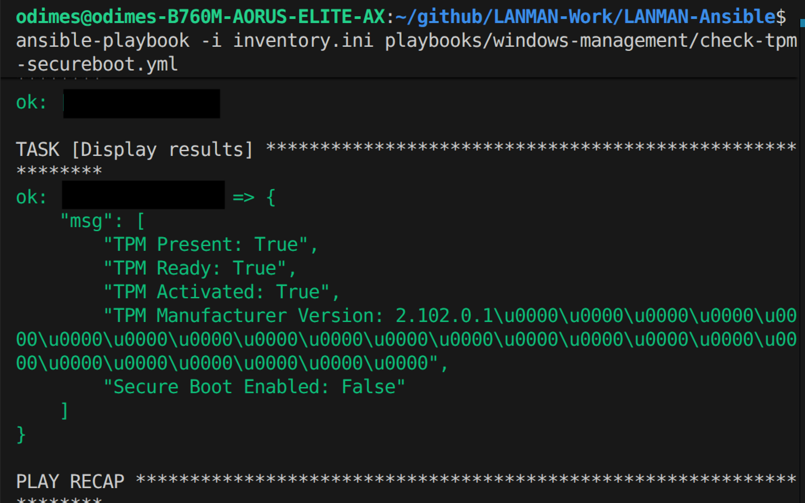

Last week, I started working on a little project to make some Ansible playbooks for use in a Windows gaming centric environment, and it's been a lot of fun diving into the world of writing/testing Ansible playbooks.

This post will be slightly shorter and will be more showcasing what I've been working on in my spare time. I hope you enjoy some of the stuff I'm showing off today.

# Part 1 : Booting up some more games

Last time, we only had games from the Steam launcher working. Now we added support for Ubisoft Connect titles. If the title is installed on the client system, we can simply boot it up with the URI which looks like this.

`uplay://launch/{appid}/{mode}`

The `appid` represents the ID of the game, the `mode` is to select how to boot the game (going into single player or multiplayer, it's much more common in older titles). The `mode` should be set to 0 most of the time.

We can do a simple Ansible script that handles the boot of these games, like below :

```yaml
---
# This is a bit messier than I'd like due to an issue with SSH Sessions
- name: Boot Up Ubisoft game via AppID
  hosts: windows
  gather_facts: no
  # Defining the stuff here
  vars:
    task_name: LaunchUbiGame # Could do some iterating
    ubi_appid: 109 # This is Splinter Cells App ID (easy to run in VM hence the choice)
    mode: 0 # Games may have multiple modes (such as singleplayer/multiplayer, DX11/DX12/Vulkan and more)
    ubi_uri: "uplay://launch/{{ ubi_appid }}/{{ mode }}"

  tasks:
    - name: Create scheduled task to launch Ubisoft game
      community.windows.win_scheduled_task:
        name: "{{ task_name }}"
        description: Temporary task to launch ubisoft game
        actions:
          - path: cmd.exe
            arguments: "/c start {{ ubi_uri }}"
        # To make it clear, with the registration flag, will run immedaitely
        triggers:
          - type: registration
        username: "{{ ansible_user }}"
        logon_type: interactive_token
        run_level: highest
        state: present

    - name: Run the scheduled task
      ansible.windows.win_command: schtasks /run /tn "{{ task_name }}"

    # Should make add a wait for the application in question to boot but I'm unsure
    - name: Wait for 30 seconds for game to launch
      ansible.builtin.pause:
        seconds: 30

    - name: Delete scheduled task
      community.windows.win_scheduled_task:
        name: "{{ task_name }}"
        state: absent
```

I want to implement EA/Epic Games in near future, I need to spend a bit more time as the Epic Games Client doesn't seem to play nice in my virtual machine at the moment and the EA Desktop client doesn't seem to support URI stuff which makes it a little tricky.

# Part 2 : Check TPM/Secure boot status

One of the main things I wanted to focus on today was inspired by an issue I experienced the other day. I've been dual booting my system between Ubuntu 24.04LTS and Windows 11 (I do a lot of my dev work in Ubuntu at the moment, but I like to keep Windows mostly for gaming and media consumption) and I wanted to play a game, and it turns out I didn't have secure boot enabled on my system and some newer games mandate the requirement of having secure boot turned on.

So I wanted to write a quick diagnostics playbook to confirm that secure boot and TPM are turned on the system. The way I ended up doing this was writing a PowerShell that would output some commands to a JSON file like so :

```powershell
# Simple powershell script for checking secureboot/tpm status
# Note, this has been split into its own script for Source Control sakes.
$result = @{}
try {
    $tpm = Get-Tpm -ErrorAction Stop
    # Below we are attaching all the information
    $result.TpmPresent = $tpm.TpmPresent
    $result.TpmReady = $tpm.TpmReady
    $result.TpmActivated = $tpm.TpmActivated
    # Below is not that useful, but might be useful if we are swapping tpm chips for whatever reason
    $result.TpmVersion = $tpm.ManufacturerVersion
}
catch{
    $result.TpmPresent = "Unknown"
    $result.TpmReady = "Unknown"
    $result.TpmActivated = "Unknown"
    # Below is not that useful, but might be useful if we are swapping tpm chips for whatever reason
    $result.TpmVersion = "Unknown"
}
try {
    $secureBoot = Confirm-SecureBootUEFI -ErrorAction Stop
    $result.SecureBootEnabled = $secureBoot
}catch{
    $result.SecureBootEnabled = "Unknown"
}

# At the end, convert to JSON for use with other systems
$result | ConvertTo-Json
```

I separated the script from the Ansible playbook to make things a bit more tidy as I didn't want the Ansible playbook to just be full of PowerShell commands. We can simply use lookup() and just use the file like so :

```yaml
---
# This playbook will simply output whether the system has secure boot/tpm turned on
# This is needed due to some games requiring this to be on at all times
# All we want to do is to output the status. Not needing to do anything with it yet though.
- name: Check TPM/Secure Boot Status
  hosts: windows
  gather_facts: false
  tasks:
    # Run the script (can be found under scripts if you want to modify it yourself)
    - name: Run Powershell Script
      ansible.windows.win_shell: "{{ lookup('file', 'scripts/check-tpm-secureboot.ps1')}}"
      register: script_output

    # Grab the JSON output
    - name: Parse JSON result
      set_fact:
        tpm_present: "{{ (script_output.stdout | from_json).TpmPresent }}"
        tpm_ready: "{{ (script_output.stdout | from_json).TpmReady }}"
        tpm_activated: "{{ (script_output.stdout | from_json).TpmActivated }}"
        tpm_version: "{{ (script_output.stdout | from_json).TpmVersion }}"
        secure_boot_enabled: "{{ (script_output.stdout | from_json).SecureBootEnabled }}"

    # Display the results in Ansible, not sure what to do with the output yet
    - name: Display results
      debug:
        msg:
          - "TPM Present: {{ tpm_present }}"
          - "TPM Ready: {{ tpm_ready }}"
          - "TPM Activated: {{ tpm_activated }}"
          - "TPM Manufacturer Version: {{ tpm_version }}"
          - "Secure Boot Enabled: {{ secure_boot_enabled }}"
```

With the script above, we are just simply outputting the status of the system into the terminal. We should do some conditionals based on the results such as alerting the machine that these things aren't enabled.


_Output from running the Ansible playbook by itself_

Whilst here, I also did a quick network config script, although the output isn't particularly nice, it's mostly meant for debugging but could turn it into something useful later.

The PowerShell script :

```powershell
# Check the network config and report back to ansible
$result = @{}
$ipconfig = ipconfig | ConvertTo-Json
$DNSResolution = Resolve-DnsName -Name "www.google.com"

# Attach IP Config
$result.ipconfig = $ipconfig
$result.DNSResolution = $DNSResolution

$result | ConvertTo-Json
```

And the Ansible playbook :

```yaml
---
- name: Check Network Config via Powershell
  hosts: windows
  gather_facts: false
  tasks:
    - name: Run Powershell Script
      ansible.windows.win_shell: "{{ lookup('file', 'scripts/check-network-status.ps1')}}"
      register: script_output
    - name: Parse JSON result
      set_fact:
        ipconfig: "{{ (script_output.stdout | from_json).ipconfig }}"
        dnsres: "{{ (script_output.stdout | from_json).DNSResolution }}"
    - name: Display results
      debug:
        msg:
          - "ipconfig: {{ ipconfig }}"
          - "dns: {{ dnsres }}"
```

I'll do a bit more work on this in the near future.

# Part 3 : Booting up custom programs/websites

The next thing I wanted to tackle was to allow to do some simple booting up and opening up certain things on the Windows machines in question. We can do Steam and Ubisoft games, but we can't do any old executables or opening up websites. Hence, me spending some time to get this stuff up and running.

The method to do this very similar to the Steam/Ubisoft stuff we tackled earlier, we need to do the scheduled task trick as we are using the SSH key method, but otherwise it works relatively well.

There are some interesting use cases, especially for the custom program as you could have an executable that autoplay some vide with VLC or does something hyper specific in the Windows environment. Whilst I like to keep everything within an Ansible playbook as it is very easy to keep track of, I think it is worth allowing option to run an executable like this.

So here is an Ansible playbook to open up any website on **default** web browser :

```yaml
---
- name: Open up website on Browser
  hosts: windows
  gather_facts: no
  vars:
    task_name: Open Website # Could do some iterating
    website_uri: "https://www.google.com" # This can be
  tasks:
    - name: Create scheduled task to launch Ubisoft game
      community.windows.win_scheduled_task:
        name: "{{ task_name }}"
        description: Temporary task to launch ubisoft game
        actions:
          - path: cmd.exe
            arguments: "/c start {{ website_uri }}"
        triggers:
          - type: registration
        username: "{{ ansible_user }}"
        logon_type: interactive_token
        run_level: highest
        state: present
    - name: Run the scheduled task
      ansible.windows.win_command: schtasks /run /tn "{{ task_name }}"
    - name: Wait for 30 seconds for game to launch
      ansible.builtin.pause:
        seconds: 30
    - name: Delete scheduled task
      community.windows.win_scheduled_task:
        name: "{{ task_name }}"
        state: absent
```

So here is an Ansible playbook to open up any program on the system :

```yaml
---
# This can be used for any program
# Useful for DRM Free copies of DOOM =)
- name: Launch an Executable via Scheduled Task
  hosts: windows
  gather_facts: no

  vars:
    task_name: Launch Executable
    exe_path: "C:\\temp\\HWiNFO64.exe" # Full path to the executable on Windows
  tasks:
    - name: Create scheduled task to run the executable
      community.windows.win_scheduled_task:
        name: "{{ task_name }}"
        description: Temporary task to launch an executable
        actions:
          - path: "cmd.exe"
            arguments: "/c start {{exe_path}}"
        triggers:
          - type: registration
        username: "{{ ansible_user }}" # Runs as the current Ansible user
        logon_type: interactive_token
        run_level: highest
        state: present

    - name: Run the scheduled task
      ansible.windows.win_command: schtasks /run /tn "{{ task_name }}"

    - name: Wait for 30 seconds for the application to start
      ansible.builtin.pause:
        seconds: 5

    - name: Delete scheduled task
      community.windows.win_scheduled_task:
        name: "{{ task_name }}"
        state: absent
```

# Part 4 : Now on GitHub (if you dare...)

Unlike last time, this stuff is currently up on GitHub and available for public use here.

[www.github.com/effeect/LANMAN-Ansible](https://github.com/effeect/LANMAN-Ansible/tree/main)

In the next post, I'll be doing a bit more work tidying up and allow for more variable customization as we are being quite static at the moment.
