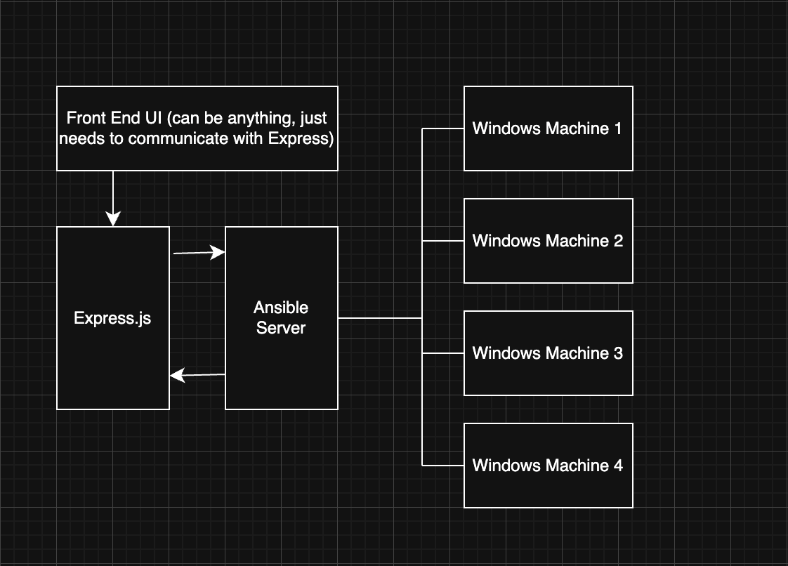

**A few weeks ago,** I wrote a post regarding using the SSH module to control a Windows system and the reason why I went so far into depth with that work is because this was a stepping stone into what I wanted to do which was make a collection/repo of Ansible playbooks focused on a LAN-Cafe type scenario.

In terms of the why, I've spent some time in Tokyo and noticed the number of eSports focused internet cafés that have popped up, whilst internet cafés have been a thing for a while, gaming focus internet cafés seem to be something that is on the rise. (I'm aware that there are a few in London as well).

And specifically with Windows, I've often found there can be a lot of troubleshooting when it comes to having the perfect gaming experience ready to go. Here's a list of common issues you could potentially have :

- **Windows Updates**
- **Game Updates**
- **Graphics Drivers being Out of Date**(usually not included in Windows or normally super out of date)
- **Logging out of Player accounts**

Whilst this is a list of issues that are mostly gaming focused, I still think there is a value to be had with the ability to automate a lot of this work without needing to be physically in front of the machine. Doing this remotely for multiple systems can save a lot of time and hassle.

**So in today's' post**, I want to focus on making a bunch of Windows gaming focused Ansible playbooks, the few I want to work on today is the following :

- Use Winget to install the game launchers
- Force Windows Updates and Reboots if needed
- Copy and run driver updates or DRM-Free game installs
- Force boot games and force log out of certain things

What I'm wanting to do with this project is to lead this work into other parts of a whole suite of tools related to this, or at the very least an Express server that can issue out long-winded Ansible commands to the hosts. Below is a diagram that showcases what I am talking about.



I'm not particularly interested in the idea of bootstrapping systems at the time of writing, especially in the case of a LAN café environment where we could have tens of computers plugged into one switch would just be an infrastructure nightmare.

# Part 1 : Using Winget to install game launchers

Time to write up the first Ansible playbook, I wanted to focus on is the following scenario :

_You need to setup x number of Windows Machine, you need to install all of the major gaming apps. How would that Ansible playbook look?_

Now there is some additional complication with this as we need to set up the Windows account, install OpenSSH onto the system we want to manage and put an SSH key here, whilst this is stuff that could be easily bootstrapped, that is out of scope but know that I will address that at some point in the neat future.

We are already assuming that the user has the Windows install in the correct place. So, all we need to do is run this playbook, note that we are doing

```yaml
tasks:
  # Display warning message to the user about the install
  - name: Display Install Message
    community.windows.win_msg:
      title: "Warning"
      text: "This playbook will install several gaming applications on your system. Please ensure you have sufficient disk space and a stable internet connection before proceeding."
      buttons: OK
  # Using Winshell to do this, other modules don't play nice with ssh windows
  # Search tool for winget stuff : https://winstall.app
  - name: Install game clients
    win_shell: |
      winget install --id {{ item }} --source winget -e --accept-source-agreements --accept-package-agreements
    loop:
      # Future plans is to have this somewhat configurable, mass installing everything seems to make sense
      - Valve.Steam
      - EpicGames.EpicGamesLauncher
      - GOG.Galaxy
```
