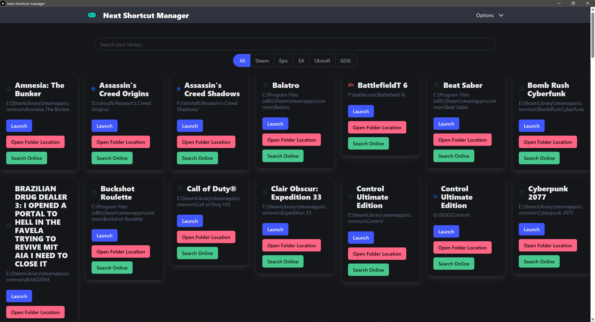
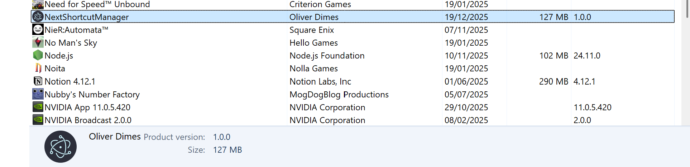

This might be an extreme first-world problem, but one of the things I have is way too many games on platforms such as Steam, Epic, GOG, EA, and the next one that will come out.

I know some people get attached to one, but personally, I mostly care about whichever platform is usually the cheapest. However, that has caused me confusion occasionally when trying to find which games I own on what platform.

Funnily enough, this wouldn’t be a problem if it weren’t for the fact that Windows search and shortcut management in the operating system is incredibly inconsistent. I don’t necessarily blame Windows for this, but it’s not a particularly great user experience.

# There are other solutions, but…

Before I decided to do a little bit of designing a solution to an extreme first world problem, it’s worth mentioning that they are lots of other solutions for this.

- Steam: There is an “add custom program” feature in Steam; however, the process of doing so is incredibly tedious. Especially if you have multiple games. Some applications can do this, such as “Emudeck” but they are quite cumbersome for something super simple.
- Playnite ([https://playnite.link](https://playnite.link)): This is a super impressive launcher and what got me thinking about other solutions for this problem. My only real gripe with this program is that it can be quite slow during the initial setup and when you have over 100+ games installed. It can take up a bit of RAM

Upon some thinking/reflection, I was thinking about potentially solving this RAM/being slow problem with some form of pre-rendering, and this is where I got the idea of using Next.js.

You see, with frameworks like Next.js and many others. They go big into this idea of pre-rendering and having pre-compiled/ready-to-go websites. And with this in mind, would a game launcher work with this idea?

And more importantly, the advantages of having this being a web app effectively means we can very easily change/update the UI. And do super radical redesigns with different UI frameworks/CSS libraries. The question is, does it work?

# Yes (sorta)


_A view of the current home screen_

There are a few asterisks, and I want to get to them, but I have developed a launcher that does the following :

- Able to read games from multiple launchers
- Able to launch said games
- Able to open up the folder location of said games
- Able to quickly search on Google about said games
- Able to add custom games as well

This UI is relatively basic and based on a Bulma example, which I’m pretty happy with. I want to do a bit more work to put it in line with a proper user interface, but for demonstration purposes. It works.

# Limitations with the current approach

Because all the game launchers store the games slightly differently, I’ve tried my best to force all the games coming in to follow a specific GameManifest type, which looks like below :

```ts
export type GameManifest = {
  name: string;
  appid: string;
  path: string;
  platform: string; // Platform in this context is the launcher to be
};
```

And it gets even more complicated with the way some of these games launch. Most of them can be handled with a URI launch parameter, but the way they may handle it may change between launchers.

Also, for the time being, we are only looking at installed games on the system and not ones you may install for the moment. Doing so will require a lot more work and taking advantage of APIs, which is something I don’t want to touch until we have to.

# How does electron tie into this

The cool part about this application is that we are using Electron wrapped in a Next.js context, which does bring some advantages. We are using electron serve to simply serve the Next.js HTML that it generates, as shown here :

```ts
const loadURL = serve({
directory: path.join(\_\_dirname, "..", "..", "renderer", "out"),
});

// A little further down
if (isDev) {
win.setMenuBarVisibility(true);
win.loadURL("http://localhost:3000");
win.webContents.openDevTools();
} else {
console.log("Loading this");
win.setMenuBarVisibility(false);
loadURL(win);
}
```

And within Electron, we effectively have a handler for each game launcher, which will run upon startup. And each game launcher has its own “library” effectively. As mentioned earlier, the returning result needs to adhere to the TypeScript type “GameManifest”.

Once these scripts have been set up, we simply set up ipc handles in the application like so :

```ts
app.whenReady().then(() => {
// Need to wrap these below in there own function I feel...
ipcMain.handle("get-installed-steam-games", steam);
ipcMain.handle("get-installed-epic-games", epic);
ipcMain.handle("get-installed-ea-games", getInstalledEAGames);
ipcMain.handle("get-installed-ubi-games", getInstalledUbiGames);
ipcMain.handle("get-installed-gog-games", getInstalledGOGGames);
// Below are two methods for System related activites
ipcMain.handle("show-item-in-folder", openFolder);
ipcMain.handle("open-web-browser", openWebBrowser);
// Custom Game stuff below
ipcMain.handle("get-custom-games", getCustomSavedGames);
ipcMain.handle("save-custom-game", saveCustomGame);
ipcMain.handle("select-game-path", selectGamePath);
...
```

# Creating a setup installer

Whilst I’ve dabbled with Electron in the past, I’ve never tried to get a Windows compiled exe running, and I managed to do so and have a GitHub workflow that takes care of it.

There are a few steps for this, but the main ones to keep in mind :

- First of all, we run a next build for the next.js app.
- Next, we compile the Typescript code to JS for Electron (I’ve used ts for the Electron app to allow the usage of types)
- Finally, we use Electron Forge to compile the application.


_Admittedly, whilst it has a bunch of default things, it's kinda cool seeing your name in appwiz.cpl in Windows._

With a simple GitHub action, we can export a basic artifact. I still need to do some extensive testing, but I’m happy that we at least got an artifact.

```yaml
name: Build Electron Exe
on: [push]

jobs:
build: # This program will only run on Windows
runs-on: windows-latest

    steps:
      - name: Checkout Code
        uses: actions/checkout@v4
      - name: Setup Node.js
        uses: actions/setup-node@v4
        with:
          node-version: 20
          cache: "npm"
      # Install all the dependencies for the program
      - name: Install Dependencies
        run: npm install
      # Run the make command which will do the following
      # - Compile the Next app into a small html export
      # - Compile the TS into JS for the electron app
      # - Package it using Maker Squirrel : https://www.electronforge.io/config/makers/squirrel.windows
      - name: Run Electron Forge Make
        run: npm run make

      - name: Upload the Electron exe
        uses: actions/upload-artifact@v4
        with:
          name: squirrel-windows-installer
          # Squirrel outputs to out/make/squirrel/win32/x64/
          path: out/make/squirrel.windows/x64
```

# This work has given me some ideas to work on next

The next project I may embark on is using some of the library automation I’ve done with the small scripts I’ve made and use them to automate Steam shortcut making. I’m well aware others are doing it already, but this solution could work really well if I tie it up well.

Also, with the way I’m handling launching games (using a URI instead of just pointing to an EXE, which seems to play nice with most launchers). It might be a good solution. I’ll have a ponder about it.

Many Thanks,
Ollie
