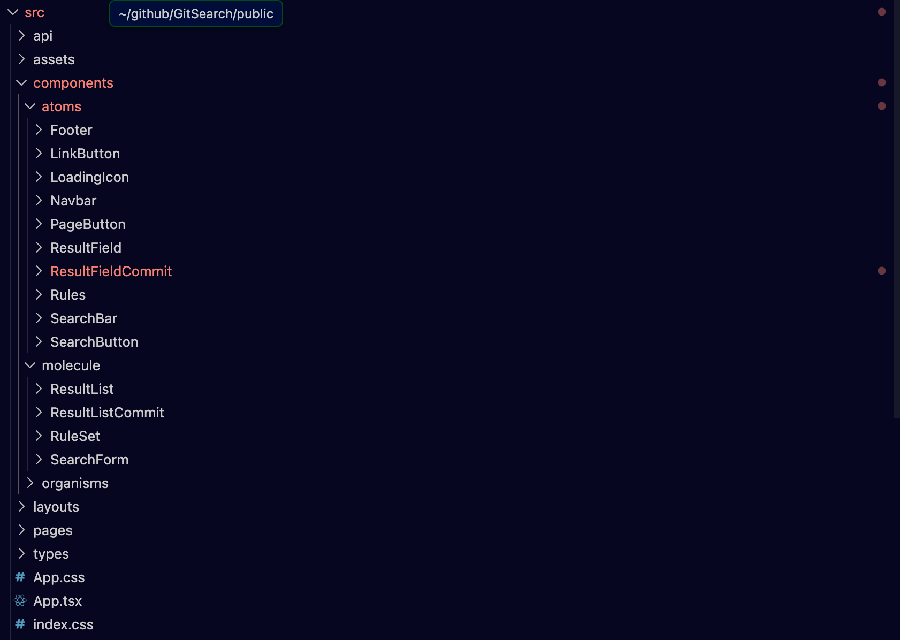

First off, happy new year! I have had plenty of rest and wanting to get back into the thick of it. But first of all wanted to revisit and do some self reflection on a project I did a few months ago as part of a technical assessment

# TL;DR, it went real bad.

Back in November, I did a technical assessment that was due to be completed in a week and it was a to develop a web app to showcase my skills.

This was one of the first times I was given a React development task in terms of designing everything from scratch. I'm not going to give details on the assessment requirements but considering that the output of the technical assessment is public, you can have a rough guess on what was asked.

However the submitted result in my opinion left a lot of be desired. [Link to the old repo](https://github.com/effeect/github-repo-search-app).

In no particular order :

- The component structure was a mess, I'm not sure I have words to describe it :
- Lack of React Query made search handling super messy and not ideal.
- All the API handling was being handled within the front end instead of being seperate, a potenial security problem if API keys are introduced and a pain to manage/update.

So I decided to start a new version of this technical assessment as a way to view my pass mistakes and see if I can learn anything new.

# Issue 1 : Components are messy

Whilst the UI appears to be similar on first glance for this web app, it's important to note that the component file structure is significantly tidier in this iteration of the app.


_View in Visual Studio Code of my new approach_

I decided to adopt an atomic design principal, this is my first time doing it and whilst I don't think its perfect, its miles better than before and it should allow me to do automated tests quite easily. Youy can read more about what this design principle means [here](https://medium.com/@abdallahosama8053/mastering-atomic-design-in-react-a-practical-guide-for-scalable-ui-architecture-bbb86abed541).

# Issue 2 : API handling with Node.js/Express API stuff

Next, what I wanted to do is to handle the API handling in a seperate container/service. The reason for doing this is that I can keep all the API stuff that goes and fetches in a seperate container. There are a few key advantages for doing this :

- Can update the API/UI seperately without needing to generate a whole new artifact (quite useful in a CI/CD context)
- Security is much better and in-line of best practises. As no API keys should be accessible from the UI front end
- Able to take advantage of make custom returns if we don't like what Github Octokit is giving.

This was suprsingly quick to do with the help of express, the express file looks like this at the moment :

```js
// Simple Express Server that will handle the Github Requests
const express = require("express");
const cors = require("cors"); // For development, handle CORS

const app = express();
// MAKE CONFIGURABLE!!!
const PORT = 5000;

// Middleware
app.use(cors());
app.use(express.json());

// Example API Endpoint
app.get("/api/data", (req, res) => {
  res.json({ message: "Data fetched from Express API!" });
});

app.use("/api/search/repos", require("./routes/api/repos"));
app.use("/api/search/details", require("./routes/api/details"));
app.use("/api/search/commits", require("./routes/api/commits"));

app.listen(PORT, () => {
  console.log(`Express server running on http://localhost:${PORT}`);
});
```

And it works quite nicely for the moment, its currently in a seperate public repo but I should be able to create a docker compose script that combines both of these projects when the time comes.

# Issue 3 : Use of React Query

Because of my experience using React has been hyper specific, I'm embarrased to say that I've never touched React Query till fairly recently. And with my fairly limited time with it I think I might be a believer in it.

You see, I had an issue with handling pagination and trying to cache data so I didn't need to refetch data and it was an absolute pain to manage and way too many lines as I needed to take into account state change and query changes. Fortantely, all that is needed for React Query to function is just this :

```js
const { data, isLoading, error } = useQuery({
  // The Query Key uses the URL-driven state directly
  queryKey: [
    "repoData",
    { q: queryParam, per_page: perPageParam, page: pageParam },
  ],
  queryFn: () => fetchRepoData(queryParam, perPageParam, pageParam),
  enabled: !!queryParam, // Only fetch if a query exists
  staleTime: 1000 * 60 * 5,
});
```

This make the overall experience of the app so so so much better and I'm a bit annoyed that I didn't use it sooner.

# Not feature parity yet but will be soon

This current iteration of the app does not have feature parity with the original but I'm trying to make sure I don't dive straight into making things I can't use and trying to plan my development a bit more careful.

I will likely write a more in detail post of this reboot when its up to date and complete.

And I promise the next post will be a bit more positive as I can be a bit too negative sometimes.
