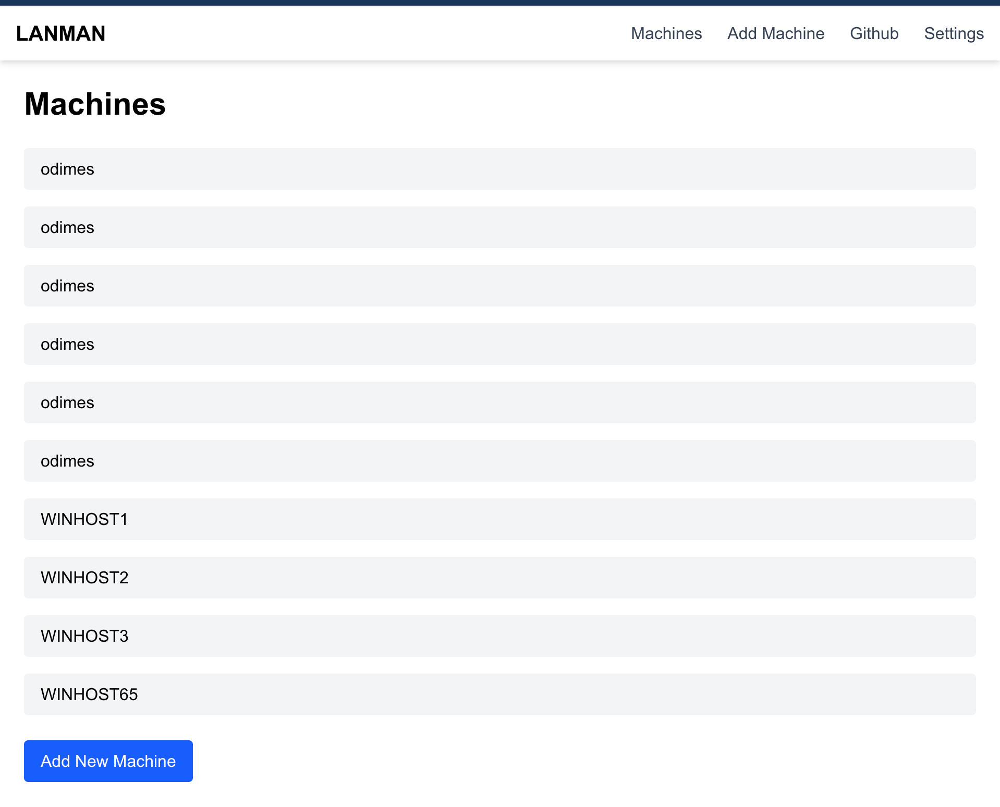

For the last few weeks, I've been working on something on the side apart from my language study and some other commitements I have going on and its an idea that has been popping around my head for the last few months.

I was watching a video, and being honest I don't remember the exact video but I was obessed with the idea of remote management in the context of a LAN party. Whilst remote management has been a tale as old as time (there are plenty of automation software out there that can be highly customised), I've often found a lot of them to be quite overkill and often requires quite a lot of fiddling in order to get it right.

My idea at the moment is fairly simple. What I want is a easy way to control a LAN party full of computers. So the "host" of the party could click something and effectively have full control over the systems to boot up something like DOOM or some other game these systems would have installed.

## How do we do it?

My plan is to build the automation part on Ansible as I've had some expercience debugging Ansible although I've haven't written anything super complex apart from a ping script and a script to offline install some dependencies long ago. I want use this project as an opportunity to learn and harness Ansible.

One positive of choosing Ansible is that there is a lot of windows support and community modules so I'm not worried about hitting into issues with Ansible in the context of Windows as what this program would be doing is fairly simple.

## The Docker Setup ATM

At the time of writing, I'm still working out things so I'm not making the code public just yet as the repo is a bit messy and I'm still working out the flow of things.

I'm building this platform on Docker mostly because it allows me to run it on multiple devices during testing and hopefully keep a stable environment. One thing I've learnt about development over the years is keeping the environment stable and consistent will save a lot of time in the future.

But by my rough calculations, this program should only need a few docker containers (hopefully):

- NextApp - Simple frontend that allows us to execute ansible playbooks against machines that we can add/remove from said UI
- Ansible/Node Container - Debian Based container that contains a node.js express server and Ansible on it, this will be responsible for running the API that will in turn run the Ansible Jobs against it
- MongoDB - Needed to store machine info, such as IP Addresses and Credentials

There are two other containers that I think may be needed. Not essential for this prototyping stage but serious enough to be a roadblock/a no go for some people

- Some secret management system, like HashiCorps vault or any other alternatives. Storing user credentials in Mongo is not a good thing.
- InfluxDB for debugging. I think having some form of stats for the machines coulld be useful.

My docker-compose file currently looks like this :

```yml
services:
  app:
    build: nextapp/.
    container_name: next-app
    ports:
      - "3000:3000"
    environment:
      - NODE_ENV=development
      - NEXT_PUBLIC_API_BASE=http://localhost:4000
    volumes:
      - ./nextapp:/app
    networks:
      test:

  ansible:
    build: ansible/.
    container_name: ansible-runner
    ports:
      - "4000:4000"
    volumes:
      - ./ansible:/app
      - ansible_node_modules:/app/node_modules
    working_dir: /app
    environment:
      MONGO_INITDB_ROOT_USERNAME: ${MONGO_ADMIN_USER}
      MONGO_INITDB_ROOT_PASSWORD: ${MONGO_ADMIN_PASS}
    networks:
      test:
  # MongoDB, responsible for storing Data about the setup
  mongodb:
    image: mongo:8.0.15
    container_name: mongodb
    restart: always
    ports:
      - "27017:27017"
    environment:
      MONGO_INITDB_ROOT_USERNAME: ${MONGO_ADMIN_USER}
      MONGO_INITDB_ROOT_PASSWORD: ${MONGO_ADMIN_PASS}
    volumes:
      - ./db:/data/db
    # Comment out below to have full mongo logs, not recommended
    command: mongod --quiet --logpath /dev/null
    networks:
      test:

networks:
  test:
    driver: bridge

volumes:
  ansible_node_modules:
```

## What I've got working :

So far we've got a UI and we are able to add Machine Info to the MongoDB and we can even run a basic ping check against the host that we've added.



I'm hoping to share some more info soon and hopefully a demo of how this works. I have a set of Windows 11 VMs ready to go for this testing and I have been able to run some basic ansible scripts. But I'd like to have more functionality such as running winget scripts or anything like that.

Going to get back to it. Many Thanks, Ollie.
