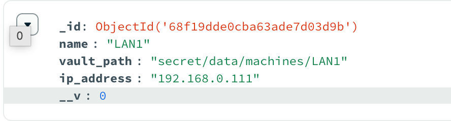

# LANMAN Updates

Wanted to give an update for a project I’ve been working on for the last week on and off inbetween my japanese study and what not. I’ve made some signficant inroads in the application and I can now do some things that I’ve not been able to do until now

# Windows Playbooks are working :

[](https://www.youtube.com/watch?v=KOW4yxhKkdQ)

Video above is a small demo and hopefully gives an idea of what I’m trying to achieve.

Opening up a notepad file and writing a bit of text doesn’t sound like much however this ansible playbook being run like this gives us a lot of flexibility and ideas about what to do next. I’m thinking of automated installs with Winget and other customisations to the system. This will be super wicked in an internet cafe and stuff which is what I’m really trying to solve here.

The setup on the Windows machine is still a bit manual but I’m certain that there is Ansible documentation out there to help me automate that intial setup as well which required me to enable WinRM and stuff

# Setup changes

One of the things I wanted to implement immediately was to implement some form of secret storage as I didn’t want to keep the user credentials in mongo. The plan is to keep the credentials in Hashicorp vault as it’s a tool I’ve used in the past.

Current docker-compose file looks like so:

```yaml
services:
  # Next.js Application
  app:
    build: nextapp/.
    container_name: next-app
    ports:
      - "3000:3000"
    environment:
      - NODE_ENV=development
      - NEXT_PUBLIC_API_BASE=http://localhost:4000
    volumes:
      - ./nextapp:/app
    networks:
      test:
  # HashiCorp Vault for secret management
  vault:
    image: hashicorp/vault:1.20.0
    container_name: vault
    cap_add:
      - IPC_LOCK
    environment:
      VAULT_DEV_ROOT_TOKEN_ID: ${VAULT_TOKEN} # Root token for dev mode
    ports:
      - "8200:8200" # Expose Vault on port 8200
    command: server -dev # Start Vault in development mode
    volumes:
      - vault:/vault/file # For future use, persistent storage in production
    healthcheck:
      test: ["CMD", "vault", "status"]
      interval: 30s
      timeout: 10s
      retries: 5
    networks:
      test:
  ansible:
    build: ansible/.
    container_name: ansible-runner
    ports:
      - "4000:4000"
    volumes:
      - ./ansible:/app
      - ansible_node_modules:/app/node_modules
    working_dir: /app
    environment:
      VAULT_TOKEN: ${VAULT_TOKEN}
      MONGO_INITDB_ROOT_USERNAME: ${MONGO_ADMIN_USER}
      MONGO_INITDB_ROOT_PASSWORD: ${MONGO_ADMIN_PASS}
    networks:
      test:
  # MongoDB, responsible for storing date about the setup
  mongodb:
    image: mongo:8.0.15
    container_name: mongodb
    restart: always
    ports:
      - "27017:27017"
    environment:
      MONGO_INITDB_ROOT_USERNAME: ${MONGO_ADMIN_USER}
      MONGO_INITDB_ROOT_PASSWORD: ${MONGO_ADMIN_PASS}
    volumes:
      - ./db:/data/db
    # Comment out below to have full mongo logs, not recommended
    command: mongod --quiet --logpath /dev/null
    networks:
      test:

networks:
  test:
    driver: bridge

volumes:
  ansible_node_modules:
  vault:
# for later implementation
#volumes:
#  - /etc/letsencrypt/live/vault.local:/vault/certs:ro
```

I did look at Mozilla SOPS but I didn’t think it was approaite. Designing this system is a bit of pain as these aren’t user credentials for the user its for other machines which means we need to take into consideration that Ansible needs to access these credentials which makes balancing it a bit of a pain.


The good news is the Ansible jobs now use the vault. I'm creating a path for the secret in mongodb so it knows where to look however we should be able to remove this and keep it locked down in the backend as we are identifying this by the machine id anyways.

# You can use it (although I would wait a bit)

It’s now available on [Github](https://github.com/effeect/LANMAN-Containers) although there is still a lot of work to be done on it and plenty of bugs/edge cases I’m aware. Just to name a few as of writing :

- No input validation on the /add-machine page
- Node.js backend API is incredibly messy and needs a clean-up/documentation
- Lack of documentation for the Ansible stuff

There are still some things I would like to implement, specifically being able to mass select machines to run jobs to but I’m happy with the current state things are in considering the amount of time put into it.

Many thanks, going to get back to it,
Oliver Dimes
