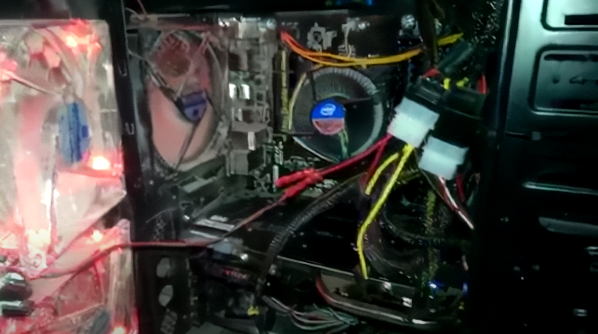
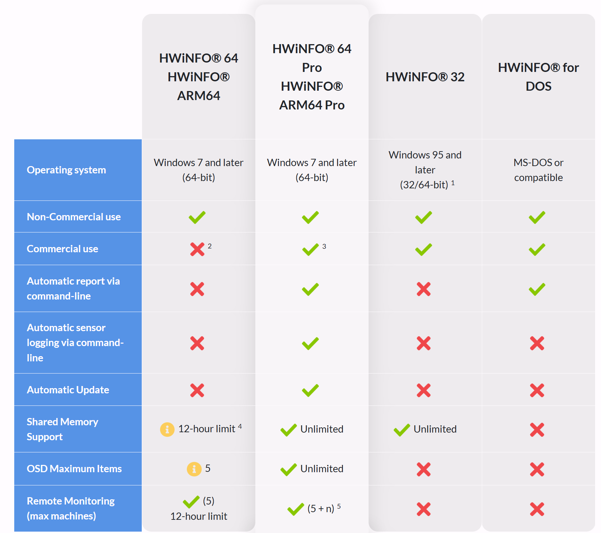
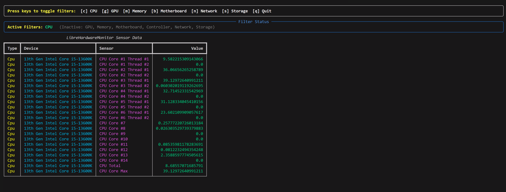
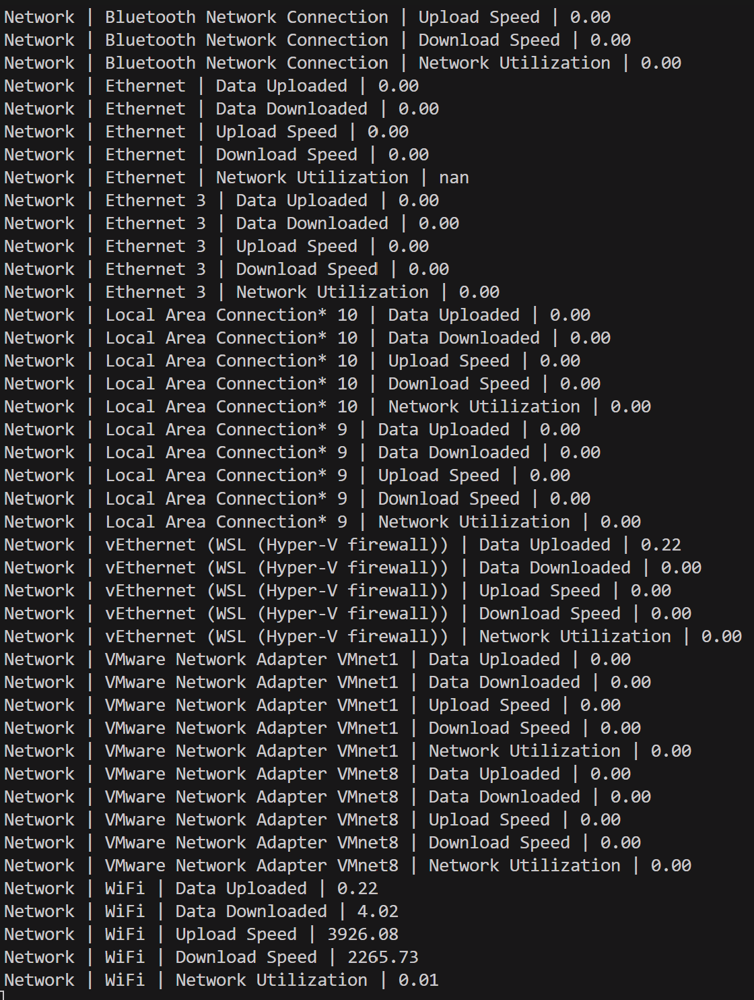

Apologies for the lack of updates in the last week or so as I've been on a brief holiday to Hokkaido early on in the week. Anyways, let's crack on.

# LibreHardware Monitor CLI Introduction

For a while, I've been interested in monitoring temperature/clock speed stuff in Windows. Originally, back when I built my first computer in 2013, which had a rocking AMD FX6300 and a GTX 670 4GB. I was quite obsessed with keeping an eye on my temperatures/clock speeds so I could get the most performance. I eventually upgraded a bit later to an Intel 4700 and an Asus GTX 970 the following year.

_Picture of my PC from around 2013_

And _for_ quite a while, there have been a few programs that you could use in order to grab sensor data. There are a few specific programs that people would normally refer to :

- [MSI Afterburner](https://www.msi.com/Landing/afterburner/graphics-cards) - More meant for GPU stats, but it can display CPU info if selected
- [HWInfo](https://www.hwinfo.com/) - Can show all current sensor data from a variety of sources
- [Intel XTU](https://www.intel.com/content/www/us/en/download/17881/intel-extreme-tuning-utility-intel-xtu.html) and [Ryzen Master](https://www.amd.com/en/products/software/ryzen-master.html) - CPU vendor-specific tools, more meant for system config (overclocking, undervolting and other) but can display CPU sensor data.

Out of all of these, I've often recommended HWInfo as a tool, as it tends to play nicely with multiple systems in a Windows environment. I've even found it to work well in a Server environment, which is really useful.

# However, there is a price

Despite HWInfo being great, if you want to use the CLI, you will need to fork out some money for it. And having the CLI might seem like a small detail, but if you wanted to do something like :

- Run an Ansible Job that checks if a sensor is running ok
- Run an InfluxDB database and store the sensor data, and create alerts (sending out emails) if CPU temperatures are overheating

You will need to use the CLI, and you will need to fork over some money to do so. And there are some other features that you might want to use as well.

# Now enter LibreHardwareMonitor (fork of OpenHardwareMonitor)

There are open-source alternatives that might be able to fill in the gap if you don't want to fork over money for a license. And there is [LibreHardwareMonitor](https://github.com/LibreHardwareMonitor/LibreHardwareMonitor).

This is a project that is actually a fork of a previous project called OpenHardwareMonitor, a project which was sadly archived back in 2020. Whilst this seems insignificant at first, newer hardware, such as newer AMD Epyc parts and anything forthcoming, seems to have issues with using OpenHardwareMonitor.

As the README states on the Librehardwaremonitor repo, it can grab the following sensor info :

- Motherboards
- Intel and AMD processors
- NVIDIA and AMD graphics cards
- HDD, SSD and NVMe hard drives
- Network cards

Whilst there is a GUI that is included. What I am really interested in is creating a CLI solution that could help with some ideas for future projects. For example, I want to create some system stat info stuff for my LANMAN project, and I think this could be a neat addition.

And being able to plug this CLI up into other projects, such as a PowerShell script or Ansible playbooks, would be sick to have as well.

# Design goals with my CLI

There are a few requirements that I wanted to achieve with this :

- Have a one-time portable executable
- Able to filter on and off which sensors to grab
- A fancy CLI output with the option to just print raw stuff

And I've actually managed to build it. It's a one-time executable that works quite nicely and doesn't require any additional setup from the user.

_Sensor Data with the fancy table output which I got working quite nicely_

There are a few things that I still want to work on, but at the moment, we have met many of the design goals. We've got a raw mode which should allow easy hooking into PowerShell scripts.

There are a few parameters that can do the following (taken from the GitHub readme):

- `--no-table` : If this is set, the output will be a simple console output, otherwise it will use Rich to display a table of the sensor data
- `--time <seconds>` : This is the time interval between each data

The following options can be used to filter the sensors displayed. If none are set, all sensors will be shown. This is useful as certain CPUs may have hundreads of sensors (eg. a high end server CPU).

- `--CPU` : If this is set, only CPU related sensors will be shown
- `--GPU` : If this is set, only GPU related sensors will be shown
- `--RAM` : If this is set, only RAM related sensors will be shown
- `--MOTHERBOARD` : If this is set, only Mainboard related sensors will be shown
- `--CONTROLLER` : If this is set, only Controller related sensors will be shown
- `--NETWORK` : If this is set, only Network related sensors will be shown
- `--STORAGE` : If this is set, only Storage related sensors will be shown

The project is available on [Github](https://github.com/effeect/LibreHardwareMonitorCLI/tree/main)

# Quirks with LibreHardware Monitor

With LibrehardwareMonitor, there are some quirks with collecting data this way using wmic. The first one is that some but not all of the sensors are locked behind admin privs.

For example, I've noticed some Intel CPU sensors will not appear if the CLI is not running with admin privs, which makes this not ideal.

# Release Status

I've released some of the versions in pre-release on GitHub under the releases tab. I'll release a stable version once I've tidied up some of the code, documentation is up to standard and added some resilience into the code to stop potential errors.

Many Thanks,
Oliver
