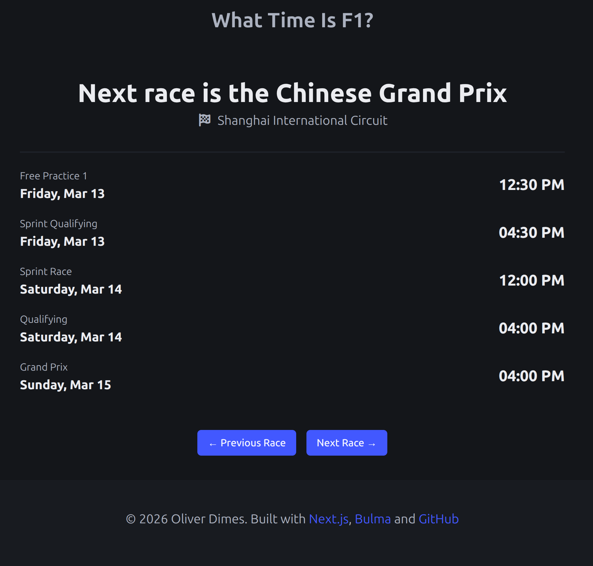

I decided to continue to do some work on this site as I was wanting to implement another feature to this fairly basic statically generated site. What I wanted to do was to implement a way to get the entire F1 schedule for the year, and then display a timetable for each round. At the time of writing, there are 24 rounds (races) in the calendar for 2026.

# Creating a new API handler for a full race schedule:

One of the first things we needed to do was to change the way we were fetching data for the Next.js static site generation as we were only grabbing the “next” race rather than the full race schedule. This wasn’t as difficult as I thought it would be as the API we are using does return the full race schedule if you put the year at the end of the url like so :

```jsx
let currentYear = new Date().getFullYear();
// First of all, need to fetch the count for the total number of files
const baseUrl = `http://api.jolpi.ca/ergast/f1/${currentYear}`;
```

So all we needed to do was to loop through the race schedule and create a custom json object, with all the races stored in an array like so :

```jsx
// Get the schedule and saves it to a public.json for use
const fs = require("fs");
const path = require("path");

// Get the full year schedule and save it to a custom json file for rendering in next.js
async function getYearSchedule() {
  let currentYear = new Date().getFullYear();
  // First of all, need to fetch the count for the total number of files
  const baseUrl = `http://api.jolpi.ca/ergast/f1/${currentYear}`;
  // Get the total count of the races for the year
  const Races = await fetch(baseUrl, { method: "GET" })
    .then((res) => res.json())
    .then((data) => data.MRData.RaceTable.Races);
  let customRaceData = [];
  try {
    for (let i = 0; i < Races.length; i++) {
      let sessions = {};
      // Checking if this is a sprint weekend or not
      if (!Races[i].SecondPractice) {
        sessions = {
          fp1: Races[i].FirstPractice,
          sprintqualifying: Races[i].SprintQualifying,
          sprint: Races[i].Sprint,
          qualifying: Races[i].Qualifying,
          race: Races[i],
        };
      } else {
        sessions = {
          fp1: Races[i].FirstPractice,
          fp2: Races[i].SecondPractice,
          fp3: Races[i].ThirdPractice,
          qualifying: Races[i].Qualifying,
          race: Races[i],
        };
      }
      // Processed Data for each race round
      const customRaceDataItem = {
        race: {
          name: Races[i].raceName,
          circuit: Races[i].Circuit.circuitName,
          date: Races[i].date,
          time: Races[i].time,
          sessions,
        },
      };
      customRaceData.push(customRaceDataItem);
    }

    const processedData = {
      lastUpdated: new Date().toISOString(),
      customRaceData,
    };

    const outputPath = path.join(
      process.cwd(),
      "public",
      "data",
      `year_schedule_${currentYear}.json`,
    );

    fs.writeFileSync(outputPath, JSON.stringify(processedData, null, 2));
    // return data;
  } catch (error) {
    // If we hit an error when reaching the endpoint, just exit the application
    console.error("Error fetching F1 schedule:", error.message);
    process.exit(1);
  }
}

// Run the main thing
getYearSchedule();
```

When the script above is run in a CI/CD pipeline, we should spit out a .json file containing the entire race schedule for the year. To keep things in check, we are only worried about the current year and not any future or past years as I don’t want to have hundreds of pages to just show the time. And I feel if you really needed to know that, you might be better off with a historic record on Wikipedia or some other source of information.

# Static Params in Next.js

The next step was to get this info into Next.js in order to render, to do this we can simply create a `race/[round]/` folder structure which means that if you navigate to `/race/1`, you will get the first race and so on.

This can be done via using the generateStaticParams, in this case we will use the round number. It might make more sense to use the track name or some other identifying info but the round number is the most simple and easiest way to handle this :

```jsx
// Grab the static params for each round from the year schedule data
export async function generateStaticParams() {
  const yearRaceData = await getYearRaceData();
  return yearRaceData.customRaceData.map((item: any) => ({
    round: item.race.sessions.race.round,
  }));
}
```

And in this page, we simply display the data needed by using the parameters that we grab from the staitcParams we setup earlier

```jsx
const { round } = await params;
const data = await getYearRaceData();
const currentIndex = data.customRaceData.findIndex(
(item: any) => item.race.sessions.race.round === round,
);
const raceEntry = data.customRaceData.find(
(item: any) => item.race.sessions.race.round === round,
);
```

With this info, we can display the round information as we did before just by using the raceEntry object. The current index is needed so that we can have navigation buttons that allow us to go to the next race and the previous race when applicable. The navigation UI component looks like this :

```jsx
import React from "react";
import Link from "next/link";

const NavigationBar = ({
  data,
  currentIndex,
}: {
  data: any;
  currentIndex: number;
}) => {
  console.log(currentIndex);
  // Need to do some work for this
  const prevRace = data.customRaceData[Number(currentIndex) - 1];
  const nextRace = data.customRaceData[Number(currentIndex) + 1];

  return (
    <>
      {/* Navigation Controls */}
      <div className="container has-text-centered">
        {prevRace ? (
          <Link
            href={`/race/${prevRace.race.sessions.race.round}`}
            className="button is-link mr-2"
          >
            ← Previous Race
          </Link>
        ) : (
          <div />
        )}
        {/* <div className="md-1" /> */}
        {nextRace ? (
          <Link
            href={`/race/${nextRace.race.sessions.race.round}`}
            className="button is-link ml-2"
          >
            Next Race →
          </Link>
        ) : (
          <div />
        )}
      </div>
      <div className="my-4"></div>
    </>
  );
};

export default NavigationBar;

```

After some more touch ups such as adding a permanent redirect on the home page which will take you to the current next race (so the site behaves the same as before if you just link the main homepage).


_A view of the website_

I would like to do some visual redesign (as you can tell, we are using the same footer as the blog) however technically I am happy with the state of the site.

You can check it out here : [https://what-time-is-f1-next.vercel.app/](https://what-time-is-f1-next.vercel.app/)
