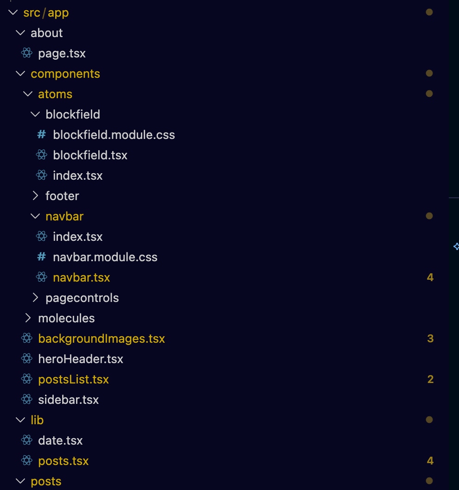

So only a day after the last post, I decided to put my mind into action and tackle one of my biggest pet peeves on this blog, which was the way it was set up with Tailwind.

# Taking Tailwind off this blog

The main change I decided to do this week and effectively take off the band-aid was the use of **Tailwind**.

To be clear, I think Tailwind is a super viable library for projects, and I've found it to be extremely useful during prototyping. However, as of late, I've been doing a lot more modifications to CSS, and I've found it incredibly sticky.

What I mean by "sticky" is the idea that Tailwind allows you to add lots of utility classes to your divs without writing a bit of CSS or JS. Which sounds great, but what I've found is that when you want to start breaking down your components, it gets particularly messy.

At some point with Tailwind, I think you will find a point where you want to make a minor change, but because the class names are literally everywhere, it’s an absolute pain to change. And especially if you want it to be specifically scoped, that is a big issue with some frameworks. Hence, why I decided to switch over.

# Switching over to Bulma was quite simple

[Bulma](https://bulma.io/) is a CSS framework that I found that appears to be a nice stop gap, it comes with a lot of basic classes that someone could need, the thing that I particularly like is that there isn't too much fluff which allows you to quickly create some minor css modules and make new css changes or override what Bulma does by default.

I was able to make a bunch of changes and simply plug in the Bulma replacements without having to make too many fundamental changes to the way I was drawing the website.

For example, my navbar :

```jsx
//Special thanks to https://codesandbox.io/p/sandbox/link-hover-t2rxxv?file=%2Findex.html%3A11%2C1-22%2C11&from-embed for the hover effect inspiration
export default function Navbar() {
  // Define States
  const [isActive, setIsActive] = useState(false);
  return (
    <>
      <nav className={`navbar`} role="navigation" aria-label="main navigation">
        <div className="container">
          <div className="navbar-brand">
            <Link href="/" className={`navbar-item ${styles.logoText}`}>
              oliverdimes.dev
            </Link>

            <button
              onClick={() => setIsActive(!isActive)}
              className={`navbar-burger ${isActive ? "is-active" : ""}`}
              aria-label="menu"
              aria-expanded="false"
            >
              {/* Seem to need four lines for this? */}
              <span aria-hidden="true"></span>
              <span aria-hidden="true"></span>
              <span aria-hidden="true"></span>
              <span aria-hidden="true"></span>
            </button>
          </div>
          <div className={`navbar-menu ${isActive ? "is-active" : ""}`}>
            <div className="navbar-start">{/* 2. Text Link 1 */}</div>

            <div className="navbar-end">
              <Link href="/posts" className="navbar-item">
                Posts
              </Link>
              {/* 3. Text Link 2 */}
              <Link href="/about" className="navbar-item">
                About
              </Link>
              {/* 4. Icon Link 1 (GitHub) */}
              <a href="https://github.com/effeect" className="navbar-item">
                <span className="icon">
                  <FontAwesomeIcon icon={faGithub} />
                </span>
              </a>
              <a
                href="https://www.linkedin.com/in/oliver-dimes-793b31194/"
                className="navbar-item"
              >
                <span className="icon">
                  <FontAwesomeIcon icon={faLinkedin} />
                </span>
              </a>
              <a
                href="https://bsky.app/profile/effeect.bsky.social"
                className="navbar-item"
              >
                <span className="icon">
                  <FontAwesomeIcon icon={faBluesky} />
                </span>
              </a>
            </div>
          </div>
        </div>
      </nav>

      {/* <div className="mb-20"></div> */}
    </>
  );
}
```

There is a lot less additional things needed for me personally in order to get a page up and be mostly content with it now. And its fairly quick and easy to add a simple css module if needed.

# Bulma is not the only significant change

As part of the Bulma implementation, I've made a conscious effort to put the components in a much tidier format, specifically similar to what I've done previously with the atom-based structure. At the time of writing, it’s not fully complete and matching, however, certain parts of the website are much, much better.


_Work in progress view of the new component structure, inspired by the atomic design structure_

# Code blocks are greatly improved

I've used some code blocks in the past, and I've always wanted to have proper highlighting in them. Because of the Tailwind plugins I was using, it was a bit of a pain to get highlighting working.

Fortunately, it's now working quite nicely as shown below :

```js
const text = "This is JS";
```

```python
text = "This is Python"
```

# Some minor complaints

Specifically my biggest gripe is that the documentation on the site can be sparse at points, I wish there was a bit more variety on the Bulma Navbar portion of the site.

- [Navbar Info](https://bulma.io/documentation/components/navbar/)

Also whilst this is a minor thing, some of the examples I've seen of people use the "text-color" class definition which is fine, however what you might not know is that Bulma does automatic dark/light mode management. So if you are like me and decide to set text to white, you will have light mode users (they do exist!) not being able to see your beautiful site. My advice is to either force the website to always use light/dark mode (can be done in the index.html) or just never define text-color. I've done the latter.

# If you are reading this, it should already be working!

At the time of this post, the website is now updated with Bulma which means the styling is much better and I have much more control.

Onto much more fun projects next, goodbye for now.
