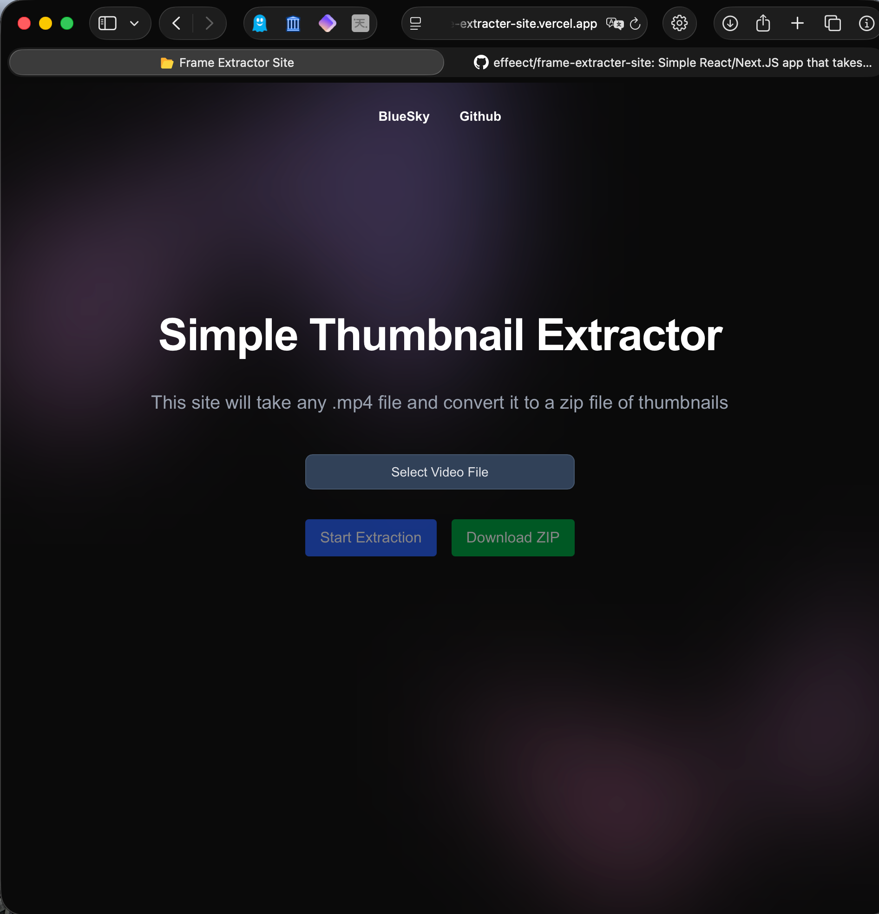
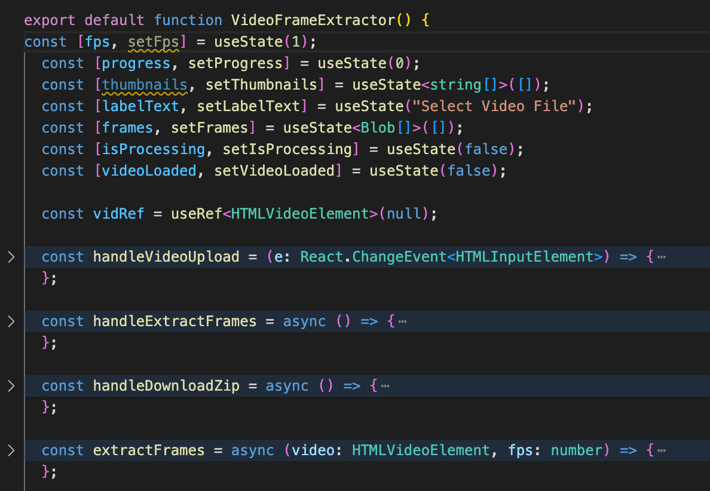

# Why?
Good question for something very simple. A couple of years ago, back when "X" used to be known as Twitter. There were quite a few accounts on that site that would post all the frames of a certain TV show or Movie and I thought hey that was pretty cool.

Now there are multiple ways to go about such a task, as someone who has dabbled with a lot of video editing in the past. You can use software such as Adobe Premiere Pro, Da Vinci Resolve or pretty much any modern video editing software. This process however could be painful as you can only do one at a time.

There were also some windows applications that would handle this however they were often had some sort of paid component or they were quite slow and I wanted something easy and quick.

# Why now though?
I've been learning some Next.JS on a course and I wanted to be able to use some of it. Whilst I did do JavaScript at university, I didn't really get an opportunity to mess around with stuff such as React which I do bitterly regret (maybe I'll write something about my Comp Sci course kinda sucked in retrospect).

So I thought hey, why don't we create a simple web app that just takes an .mp4 file and gets all the frames (within reason) and dumps the result in a .zip file and I think I got a pretty cool solution

# The Result

So right now on the [World Wide Web](https://frame-extracter-site.vercel.app), there is a project running that can do such a thing and it works on mobile as well which is pretty sick.

# Some code highlights
Since this was my first real project with next.js (apart from this blog thing of course). I decided to split up my application so I could just call it whenever I like. So the final result is just a component that gets called in the index page : 

```tsx
<div className="mx-auto max-w-2xl py-32 sm:py-48 lg:py-56">
    <div className="text-center">
    <h1 className="text-5xl font-semibold tracking-tight text-balance text-white sm:text-5xl">
        Simple Thumbnail Extractor
    </h1>
    <p className="mt-8 text-lg font-medium text-pretty text-gray-400 sm:text-xl/8">
        This site will take any .mp4 file and convert it to a zip file of thumbnails
    </p>
    <div className="mt-10 flex items-center justify-center gap-x-6">
    {/* The object should go here*/}
    <VideoFrameExtractor></VideoFrameExtractor>
    </div>
    </div>
</div>
```

# Extract.tsx
The star of the show is the extract.tsx which handles a bunch of the things we need :


They do the following :
- `handleVideoUpload` as the name suggests handle the HTML video upload, we are using React to do this and it will kick off a bunch of things when the user uploads. Note that the input tag of this function does limit the files being uploaded as .mp4 files. Not adding support for anything else at this time 
- `handleExtractFrames` is the handler for the extractFrames function
- `handleDownloadZip` will handle the zip file being able to be downloaded when its ready.
- `extractFrames` will get the images, using a html video element in order to do so

Please note that this application is mostly running on the client side and all the logic like the video image extracting is done on the client side

There is still quite a few things I would like to do with this application such as :
- Allowing some form of directory upload
- Make the UI less Tailwind stocky (not bad but it comes across as a little bland)
- It seems to be very quick on my Macbook at the moment but I have no idea on lower end machines so may be worth looking into performance increases (like less quality options if its just going to be online)

I did implement some stuff for future like doing more intircate frames per second and a thumbnail gallery but I would like to polish the above before heading into those features

Since I developed this tool with Next.js, I was able to quickly get the web app up and running as an SPA effectively. Whilst it's not much I'm pretty happy with the overall result and the cleaniness of the UI.

You can check out the website on here : https://frame-extracter-site.vercel.app
And you can also check out the Github here : https://github.com/effeect/frame-extracter-site
