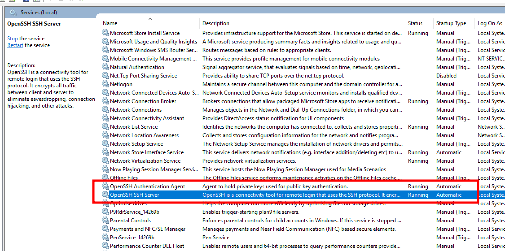
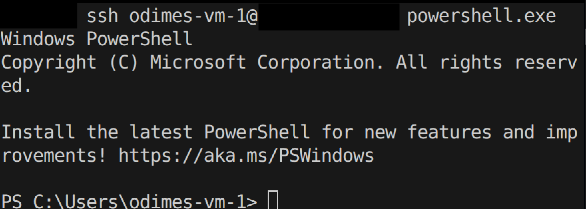
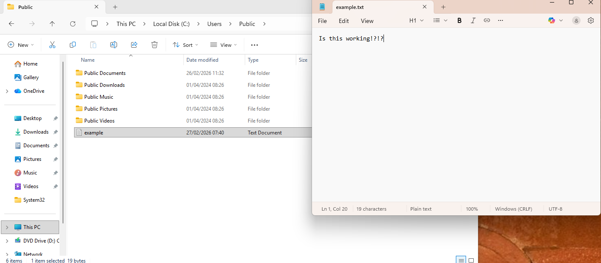
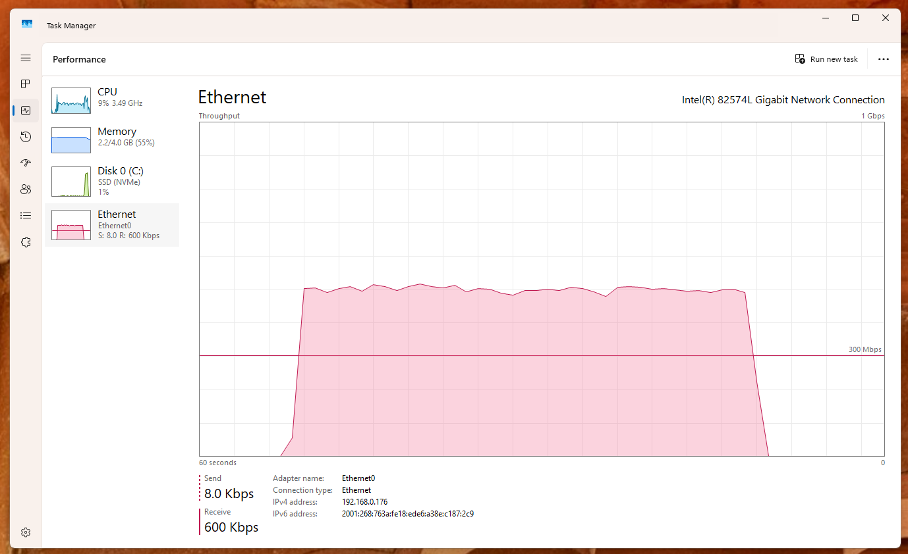
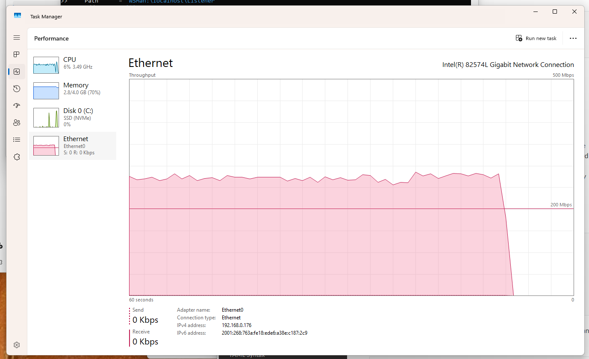

With recent versions of Ansible, there is now official support to connect to a Windows-based host using SSH rather than relying on WinRM, which has traditionally been the primary method for connecting to Windows hosts in Ansible Playbooks.

On paper, this appears to be a fairly straightforward addition. One of the main benefits I initially considered is that if you’re automating a mixture of Linux and Windows machines, you can effectively use the same connection method across all your systems, which is good thing.

However, upon setting up a virtual machine with Windows 11 on it and experimenting with this SSH connection method, I think this is much bigger deal than I initially thought. This post will be more of a guide/walkthrough rather than a development post, but I promise that it will be interesting.

# Step 1 : Setting up the Windows Host

_NOTE : All testing was conducted using Windows 11 25H2 Virtual Machines on VMware Workstation Pro with bridged network adapters. Please ensure you follow this guide using a **local account**. Instructions on Windows Server and Windows 11 are identical._

The first thing we need to do is to set up OpenSSH on Windows which can be done quickly on Windows. Make sure to run the below command with Administrator Privileges. Based on an example from [Ansible Docs](https://docs.ansible.com/projects/ansible/latest/os_guide/windows_ssh.html):

```powershell
# Install Windows Capability
Get-WindowsCapability -Name OpenSSH.Server* -Online |
    Add-WindowsCapability -Online
# Start the Windows Service
Set-Service -Name sshd -StartupType Automatic -Status Running

# Firewall Rule, you could just outright disable the firewall however not recommended...
$firewallParams = @{
    Name        = 'sshd-Server-In-TCP'
    DisplayName = 'Inbound rule for OpenSSH Server (sshd) on TCP port 22'
    Action      = 'Allow'
    Direction   = 'Inbound'
    Enabled     = 'True'  # This is not a boolean but an enum
    Profile     = 'Any'
    Protocol    = 'TCP'
    LocalPort   = 22
}
New-NetFirewallRule @firewallParams

# Shell rule for when we connect
$shellParams = @{
    Path         = 'HKLM:\SOFTWARE\OpenSSH'
    Name         = 'DefaultShell'
    Value        = 'C:\Windows\System32\WindowsPowerShell\v1.0\powershell.exe' # Points to powershell
    PropertyType = 'String'
    Force        = $true
}
New-ItemProperty @shellParams
```

Note that if this command fails, you may need to additionally install OpenSSH on your system. This can be done in two ways:

- Run the command `winget install "openssh preview" --source winget`.
- If you need an offline installer, please check the [Win32-OpenSSH](https://github.com/powershell/Win32-OpenSSH?tab=readme-ov-file) repo.

You can verify that OpenSSH is running by checking for the OpenSSH service in `services.msc`.


_In services.msc, you should see both of these OpenSSH services running with the startup type being labelled as "Automatic"_

Once OpenSSH is confirmed to be running, ensure your network setup is correct. Make sure that you can successfully connect and ping the machine across the network. For this demonstration, I’ve used a static IP address to keep things simple.

# Step 2 : Setting up Ansible with SSH Password Authentication

Next, we need to set up the connection within Ansible. I expect you to have Ansible installed in your environment. In this case, I've installed it on my local Ubuntu machine, but a docker container setup or any other setup should work fine.

First, let’s attempt to SSH into the Windows machine we just configured using a simple SSH command :

- `ssh username@your.ip.address.here`
- If you get an invalid shell request, you may need to use : `ssh username@your.ip.address.here powershell.exe`

You should be prompted to accept the key and enter a password. Enter the password, and you’ll successfully log into the system – as shown below.


_SSH into the Windows machine like this_

If that works, we'll set up the inventory file in Ansible. Note that there are other ways of doing this, but this method should work for most setups. I’ve named this file `inventory.ini` to keep things simple:

```ini
[windows]
your.ip.address.here

[windows:vars]
# Note that the below should be handled as variables/secret variables in a prod environment. Don't want passwords in plain text!
ansible_user=odimes-vm-1
ansible_password=<your-password-here>
ansible_connection=ssh
ansible_shell_type=powershell
ansible_shell_executable=None
```

Next, we’ll write a simple playbook to "write text" to a Notepad file to confirm this connection works.

```yaml
---
- name: Write some text to Notepad
  hosts: windows # Specifying the hosts we defined in the file earlier
  gather_facts: no

  # Nothing special, just writing some text to a file
  tasks:
    - name: Create or overwrite a text file
      win_copy:
        content: "Is this working!?!?"
        dest: "C:\\Users\\Public\\example.txt"
```

And running this playbook with a command like this :
`ansible-playbook write-to-notepad-playbook.yml -i inventory.ini`

The playbook should be successful and the result should look a little something like so.


_It's quite simple, but we've got an Ansible playbook working on Windows via ssh. Hooray!_

This method still represents a relatively trivial change compared to using WinRM, but this connection method offers some advantages that I will explore next.

# Step 3 : SSH Key Based Authentication

One of the key reasons I explored this approach was the ability to leverage SSH key-based authentication to connect to Windows hosts. This offers several significant advantages:

- No need for passwords, which means passwords on the user account could be reset and Ansible login details wouldn't need to be updated accordingly.
- As long as the SSH keys are on the system, you should be able to consistently access the machine as long as Ansible has the matching key available.
- Much more DevOps and CI/CD friendly, especially when only an SSH key is needed to access certain systems.

Now in order to do this, you need to do the following :

- Generate an SSH key on the Ansible System, for example `ssh-keygen -t ed25519 -C "ansible"`, no passphrase is required for this
- Once generated, copy the .pub file across to the Windows machine. The folder location can vary but if you have followed this guide with an admin account, you can copy it to `C:\ProgramData\ssh\administrators_authorized_keys`

You may need to restart the ssh service on Windows, but if you attempt to ssh to the Windows host in your terminal, you should not get a password prompt, and you should immediately connect.

What this means is as long as that the private and public ssh key are the same, you should have a valid connection between the Ansible host and the Windows machines at all times.

This means that the inventory file does not need the password field anymore, so your inventory file is a bit safer now :

```ini
[windows]
your.ip.address.here

[windows:vars]
ansible_user=odimes-vm-1
ansible_connection=ssh
ansible_shell_type=powershell
ansible_shell_executable=None
```

This all sounds great however there is still a chicken and egg issue, as you will still need a way to get the ssh key onto the Windows host, and you will either need to bootstrap it and have it available in the Windows install, do it manually which adds complication or use the ssh password option to just put the ssh key in.

It's not too difficult to automate the ssh-key copy if you have the machine password available. Although I would have thought you would just use the password. I did write this playbook that should do the trick :

```yaml
---
# This playbook is to setup SSH on Windows, specifically for the administrators account
# Need to do some thinking on this as we only want to use the password once and get it off and rely on the key for future use
- name: Configure SSH authorized_keys on Windows
  hosts: windows
  gather_facts: no

  # Need to have the ssh-keygen done already
  vars:
    public_key: "{{ lookup('file', '~/.ssh/id_ed25519.pub') }}"

  # We are expecting the ansible user to be an admin
  # Therefore, we need to do all of this to the admin path
  tasks:
    - name: Ensure .ssh directory exists
      ansible.windows.win_file:
        path: C:\ProgramData\ssh\
        state: directory
    # Create the authorized_keys file with the public key from our Ansible instance
    - name: Create authorized_keys file with public key
      ansible.windows.win_copy:
        content: "{{ public_key }}"
        dest: C:\ProgramData\ssh\administrators_authorized_keys
    - name: Remove inherited permissions
      ansible.windows.win_acl_inheritance:
        path: C:\ProgramData\ssh\administrators_authorized_keys
        state: absent
    # Grant SYSTEM access
    - name: Grant SYSTEM full control
      ansible.windows.win_acl:
        path: C:\ProgramData\ssh\administrators_authorized_keys
        user: SYSTEM
        rights: FullControl
        type: allow
    # Grant USER access
    - name: Grant user full control
      ansible.windows.win_acl:
        path: C:\ProgramData\ssh\administrators_authorized_keys
        user: "{{ ansible_user }}"
        rights: FullControl
        type: allow
```

Anyway, now you should have ssh-key based access, and it should be trivial to remote into your Windows systems with SSH and Ansible.

# Step 4 : A quick speed benchmark

One of the next things I wanted to do with this setup was to test one of the main touted benefits of SSH over WinRM which is faster transfer speeds.

The way I tested this was to copy a 2GB video file across, now considering this was being done on a VM I was skeptical if I would actually be able to see a difference but to my surprise I actually did. Before diving into the results, note that this is the Ansible playbook that was used.

```yaml
---
- name: Copy video file (2GB Test)
  hosts: windows
  tasks:
    - name: Transfer a configuration file via SSH
      ansible.windows.win_copy:
        src: /home/odimes/github/LANMAN-Work/video_file.mp4
        dest: C:\temp\video_file.mp4
```

## SSH Copy results

Took under a minute in ssh world, hitting a max speed 500Mbps according to Windows Task Manager.



## WinRM Copy result

Took 2 minutes with WinRM set to basic auth and using ntlm, hitting a max speed of 300mbps. I'm not sure why it took double the time (I was expecting it to be 1m40s-ish) however I think it's evident that it's much slower in this context.



# Potenial issues

Whilst I didn't encounter much trouble using this setup, I did spot this line in the documentation which may affect network resource access, although they appear to mention a workaround :

From [Ansible Docs](https://docs.ansible.com/projects/ansible/latest/os_guide/windows_ssh.html) :
_SSH keys work with both local and domain accounts but suffer from the double-hop issue. This means that when using SSH key authentication with Ansible, the remote session will not have access to user credentials and will fail when attempting to access a network resource. To work around this problem, you can use become on the task with the credentials of the user that needs access to the remote resource._

# Conclusion

Hopefully this post will give you some inspiration to try out the SSH capability on Windows and use it along with Ansible. This was really fun to try out and test. I'm currently working on automating some Windows' setup stuff for personal use, so I'm definitely going to incorporate it into my personal work.

# Bonus Material

If you want to read more about it, I implore you to check out the Ansible documentation here : [https://docs.ansible.com/projects/ansible/latest/os_guide/windows_ssh.html](https://docs.ansible.com/projects/ansible/latest/os_guide/windows_ssh.html)
