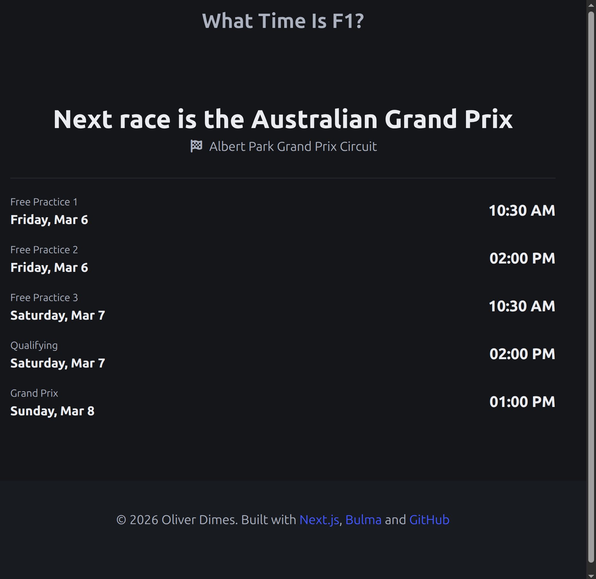

F1 is returning in 2026 and one of the projects I wanted to work on a small project to display the time of the next F1 race. Whilst this sounds like a trivial thing to do, there is a little bit of work that I needed to do in order for this solution to work as I wanted.

# What I wanted?

What I wanted to do is to have a site that could statically generate, maybe once an hour or day and it would simply display the time of the next F1 race.

I would like this to show the event at the time of day that **the user is currently at**, so if the user was in the UK, it would show the event in UK time. If the user was in Japan, it would show the event in JP time.

# The CI/CD solution

The solution I settled on was to write a simple node script to do a fetch and write to a local file, and commit that file to the repo which would then be used by the static site generation that Next.js can do.

The node script looks like below :

```js
// Get the schedule and saves it to a public.json for use
const fs = require("fs");
const path = require("path");

async function getSchedule() {
  const url = "http://api.jolpi.ca/ergast/f1/current/next.json";
  const options = { method: "GET" };

  try {
    const response = await fetch(url, options);
    const data = await response.json();

    const processedData = {
      lastUpdated: new Date().toISOString(),
      race: {
        name: data.MRData.RaceTable.Races[0].raceName,
        circuit: data.MRData.RaceTable.Races[0].Circuit.circuitName,
        date: data.MRData.RaceTable.Races[0].date,
        time: data.MRData.RaceTable.Races[0].time,
        sessions: {
          fp1: data.MRData.RaceTable.Races[0].FirstPractice,
          fp2: data.MRData.RaceTable.Races[0].SecondPractice,
          fp3: data.MRData.RaceTable.Races[0].ThirdPractice,
          qualifying: data.MRData.RaceTable.Races[0].Qualifying,
          race: data.MRData.RaceTable.Races[0],
        },
      },
    };
    const outputPath = path.join(
      process.cwd(),
      "public",
      "data",
      "schedule.json",
    );

    fs.writeFileSync(outputPath, JSON.stringify(processedData, null, 2));
    return data;
  } catch (error) {
    // If we hit an error when reaching the endpoint, just exit the application
    console.error("Error fetching F1 schedule:", error.message);
    process.exit(1);
  }
}

// Run the main thing
getSchedule();
```

The script above saves the race schedule from an API as a .json object. The CI/CD file that runs this script looks like this:

```yaml
# This workflow will do a clean installation of node dependencies, cache/restore them, build the source code and run tests across different versions of node
# For more information see: https://docs.github.com/en/actions/automating-builds-and-tests/building-and-testing-nodejs
permissions:
  contents: write

name: Get Race Schedule
on:
  schedule:
    - cron: "0 9 * * *"
  push:
    branches: ["main"]
  pull_request:
    branches: ["main"]
  workflow_dispatch: # Needed to allow for manual workflow runs (mostly for testing)

jobs:
  build:
    runs-on: ubuntu-latest
    strategy:
      matrix:
        node-version: [22.x]
        # See supported Node.js release schedule at https://nodejs.org/en/about/releases/

    steps:
      - uses: actions/checkout@v4
      - name: Use Node.js ${{ matrix.node-version }}
        uses: actions/setup-node@v4
        with:
          node-version: ${{ matrix.node-version }}
          cache: "npm"
      - run: node src/api/get-schedule.js

      - name: Commit and Push
        run: |
          git config --global user.name "github-actions[bot]"
          git config --global user.email "github-actions[bot]@users.noreply.github.com"
          git add ./public/data/schedule.json
          git commit -m "chore: update generated file" || echo "No changes to commit"
          git push
```

With these set of files, we can effectively grab the data needed for the site and display the result of that information without need to do any API calls when the user is visiting the site.

I've set to run everyday which should be fine for the moment.

# Using the data in Next.js

The **next** step in this process is to grab the data in next and I wrote a little function to handle it :

```ts
import fs from "fs";
import path from "path";

export function getRaceData() {
  try {
    if (typeof window === "undefined") {
      const filePath = path.join(
        process.cwd(),
        "public",
        "data",
        "schedule.json",
      );
      const jsonData = fs.readFileSync(filePath, "utf-8");
      return JSON.parse(jsonData);
    }

    throw new Error("Client-side: use props");
  } catch (error) {
    // Fallback data if file doesn't exist
    return {
      lastUpdated: new Date().toISOString(),
      race: {
        name: "string",
        circuit: "string",
        date: "Date",
        time: "",
        sessions: {
          fp1: { date: "", time: "" },
          fp2: { date: "", time: "" },
          fp3: { date: "", time: "" },
          qualifying: { date: "", time: "" },
          race: { date: "", time: "" },
        },
      },
    };
  }
}
```

In the typescript file above, we are reading the file from local storage and simply returning the result as a json object for the UI to utilise.

Note that this function would never be called when the using loads the site, as Next.js should statically generate this component of the site.

The final result looked something like this :



A simple enough UI based in Bulma but should be more than enough to satisfy the basic user. Getting this to work with multiple time zones was a little complicated.

# The Date() object HAS to be in client...

One thing I discovered whilst developing this UI is that where we put the data constructor can have significant impacts.

JavaScript's Date Constructor can be used in a statically generated website, but if you wanting to take timezone on the client into account. It will not do that as the date/time in this context would of already been generated.

The solution is to have the time be a "client" component which solves this issue :

```tsx
// Needs to be done on the client side

"use client";

import { useEffect, useState } from "react";

export default function TimeDisplay({
  dateTimeString,
}: {
  dateTimeString: string;
}) {
  const [mounted, setMounted] = useState(false);

  useEffect(() => {
    setMounted(true);
  }, []);

  if (!mounted) {
    return <span className="title is-2">--:--</span>;
  }

  const time = dateTimeString;

  console.log(time);

  // Convert to local time if needed

  const date = new Date(`${time}`);

  return date.toLocaleTimeString("en-US", {
    hour: "2-digit",

    minute: "2-digit",

    hour12: true,
  });
}
```

We take the time string and do the date constructor stuff on client. So all the timezone conversion stuff should happen automatically.

# What to do next?

There are a few potential avenues I can take this simple site but the next thing I would like to do is to grab the next/previous race schedule and statically generate that and allow users to go through the race schedule for that year.

- [The Website](https://what-time-is-f1-next.vercel.app/)
- [Github Repo](https://github.com/effeect/what-time-is-f1-next)

I'll create another post if I continue to put some extra work into this. Otherwise, I'm pretty happy with this outcome.

See you later.
