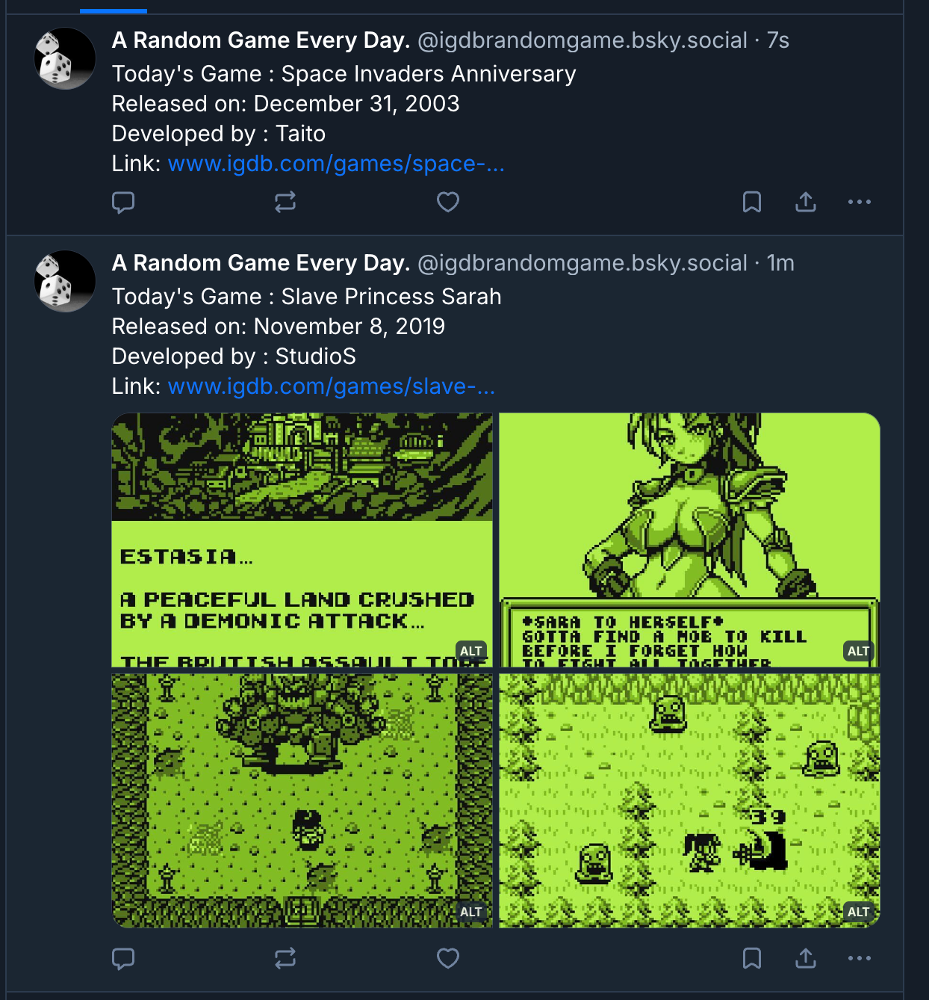

Today I decided to look into creating a simple bsky bot as I think its a rather neat idea, reminding me of the old days of Twitter where you would get fun posts. Whilst this project may be silly on the surface. It could be quite useful especially for alert systems or any critical information that users would want to know.

All of the code/work I've done in todays post will be available on [Github](https://github.com/effeect/bsky-game-of-the-day)

# Step 1 : Setting up the Post Maker

There are a few quirks with using the bsky documentation but its fairly simple in the world of Typescript, my weapon of choice for this excercise but other languages appear to be available.

Full api documentation and other tutorials can be found here : [docs.bsky.app](https://docs.bsky.app/)

## How to make a post (quickly)

It's fairly quick and easy to write a small bit of typescript in order to post on Bluesky. The quickest (albeit untidy) way to do a quick post to bluesky is to do something like this :

```ts
// Example of how to write a post to bsky with AtpAgent
// Note, this way is NOT recommended for prod use
import dotenv from "dotenv";
import { AtpAgent } from "@atproto/api";
// First of all, load the .env vars
dotenv.config();
// Declaring the new ATP agent
const agent = new AtpAgent({
  service: "https://bsky.social",
});
// Authenticate to bsky
const authenticate = async (agent: AtpAgent) => {
  await agent.login({
    identifier: process.env.BSKY_HANDLE!, // this needs to be the handle like effeect.bsky.social etc
    password: process.env.BSKY_PASSWORD!, // this needs to be an app password generated from the account
  });
};
// Authenticate the agent
await authenticate(agent);
// After the auth, we can just simply create a post (albeit a very simple one)
await agent.post({
  text: "Hello Bluesky! This is a test post from AtpAgent in TypeScript.",
  createdAt: new Date().toISOString(),
});
console.log("Post created successfully! Now exiting");
```

You will need to install the @atproto/api package which can be done with `npm install @atproto/api` but after doing that bit of code. You can quickly post to the platform. Also need to have the env variables in a .env for this to work but for such a small amount of code, it works quite nicely.

I actually did some experimentation and found it fairly quick and easy to wrap it in an express endpoint and I suspect they are a million other ways to handle this. It's pretty cool.

## How I did it

If you want a tidy way to do this, my **CreatePost.ts** under my `/lib/bsky` has a simple wrapper that allows us to quickly post stuff to the platform, regardless of what is being posted.

```ts
import { AtpAgent } from "@atproto/api";

export async function authenticate(agent: AtpAgent) {
  await agent.login({
    identifier: process.env.BSKY_HANDLE!,
    password: process.env.BSKY_PASSWORD!,
  });
}
export async function CreatePost(agent: AtpAgent, payload: any) {
  await authenticate(agent); // Authenticate to bsky before starting
  await agent.post({
    ...payload,
    createdAt: new Date().toISOString(),
  });
}
```

_Note that the authenticate function is exported as some things may need be authenticated again such as uploading stuff._

# Step 2 : What should the content be?

I didn’t start creating this project to just post “hello world” on somebody’s timeline 50 times a day. What I wanted to do was to post something akin to early Twitter, and I think I have a good gimmick.

I decided to take advantage of the awesome API of [IGDB](https://www.igdb.com/), short for Internet Games Database, which contains pretty much every game in existence with a bunch of information such as platform, summaries, developers, screenshots, and much more. What I wanted to do was to grab a random game from the API and simply display a random game on Bluesky when requested.

The good news is that writing this was pretty quick. I did need to create a client id/secret with the Twitch Developer Portal, but it works very nicely.

Under `lib/igdb/igdb-get-game.ts`, we have a fairly nice way to grab a random game from the API.

```ts
export async function getRandomGame() {
  const CLIENT_ID = process.env.IGDB_CLIENT_ID!;
  const APP_TOKEN = await getIGDBToken();

  const countRes = await fetch("https://api.igdb.com/v4/games/count", {
    method: "POST",
    headers: {
      "Client-ID": CLIENT_ID,
      Authorization: `Bearer ${APP_TOKEN}`,
    },
  });

  const { count } = await countRes.json();
  const offset = Math.floor(Math.random() * count);

  // Fetching the game in question :
  const gameRes = await fetch("https://api.igdb.com/v4/games", {
    method: "POST",
    headers: {
      "Client-ID": CLIENT_ID,
      Authorization: `Bearer ${APP_TOKEN}`,
    },
    body: textBody(offset),
  });

  const game = await gameRes.json();
  return game[0];
}
```

There was some additional formatting/wrangling I had to do to get this is a presentable form like below but overall it works really well in testing as shown below.


_A view of the post of the account active on bsky_

# Step 3 : Hosting on Github Actions!

Finally, there was the decision about how to host this and I decide to design this small script to run as a cron job in Github Actions as it would be the most efficent and will avoid having to worry about running this 24/7 and the potenial issues that it could entail.

The github action workflow looks like this:

```yml
name: Post Random Game to Bluesky
on:
  schedule:
    - cron: "0 9 * * *"
  workflow_dispatch: # Needed to allow for manual workflow runs (mostly for testing)
jobs:
  post:
    runs-on: ubuntu-latest
    steps:
      - uses: actions/checkout@v4
      - uses: actions/setup-node@v4
      - run: npm install
      # Below will do the actual posting
      - name: Post to Bsky
        run: npm start
        env:
          BSKY_HANDLE: ${{ secrets.BSKY_HANDLE }}
          BSKY_PASSWORD: ${{ secrets.BSKY_PASSWORD }}
          IGDB_CLIENT_ID: ${{ secrets.IGDB_CLIENT_ID }}
          IGDB_CLIENT_SECRET: ${{ secrets.IGDB_CLIENT_SECRET }}
```

# Conclusion (it works!)

I'm fairly happy with how this turned out in the end and I have some other ideas for early Twitter era accounts such as frame by frame movie accounts or something along those lines.

You can check out the following stuff for more info :

- My Bluesky "bot" : [https://bsky.app/profile/igdbrandomgame.bsky.social](https://bsky.app/profile/igdbrandomgame.bsky.social)
- The Github Repo : [https://github.com/effeect/bsky-game-of-the-day](https://github.com/effeect/bsky-game-of-the-day)

Anyways, I'll be back in a few days with some more projects, I promise.
